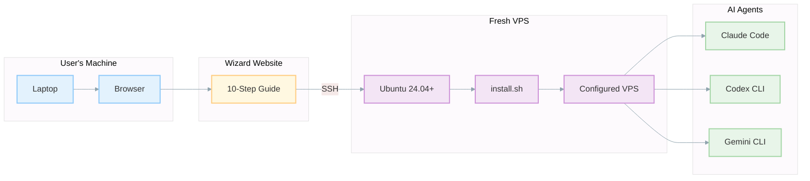
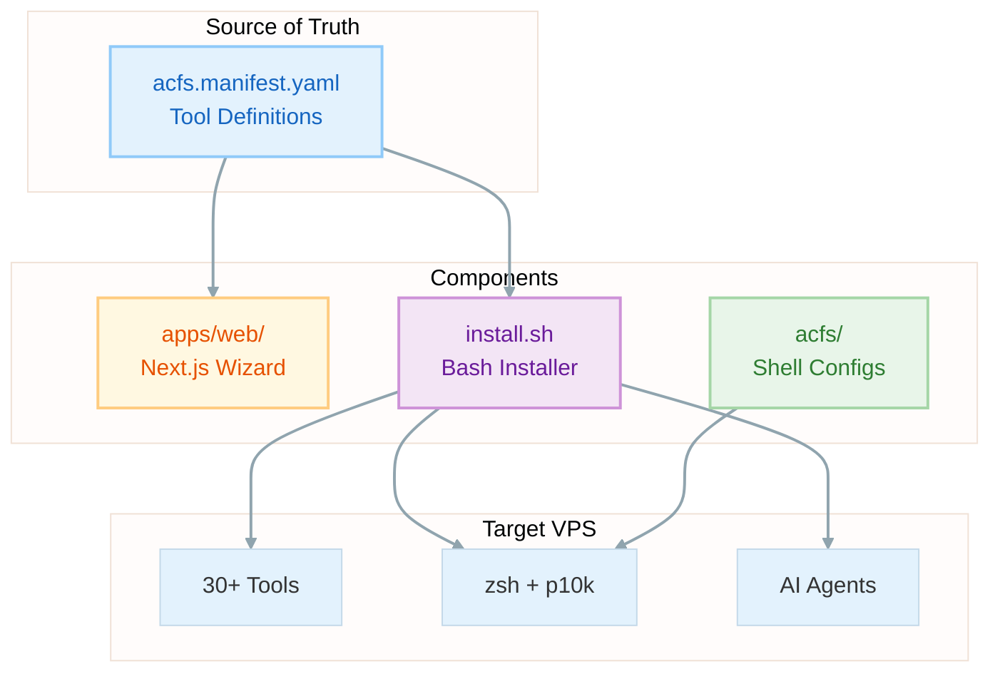
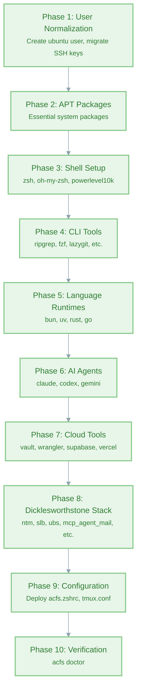

# Agentic Coding Flywheel Setup (ACFS)


> **From zero to fully-configured agentic coding VPS in 30 minutes.**
> A complete bootstrapping system that transforms a fresh Ubuntu VPS into a professional AI-powered development environment.

<div align="center" style="margin: 1.2em 0;">
  <table>
    <tr>
      <td align="center" style="padding: 8px;">
        <strong>The Vision</strong><br/>
        <sub>Beginner with laptop → Wizard → VPS → Agents coding for you</sub>
      </td>
    </tr>
  </table>
</div>

### Quick Install

```bash
curl -fsSL "https://raw.githubusercontent.com/Dicklesworthstone/agentic_coding_flywheel_setup/main/install.sh?$(date +%s)" | bash -s -- --yes --mode vibe
```

---

## TL;DR

**ACFS** is a complete system for bootstrapping agentic coding environments:

**Why you'd care:**
- **Zero to Hero:** Takes complete beginners from "I have a laptop" to "I have Claude/Codex/Gemini agents writing code for me on a VPS"
- **One-Liner Magic:** A single `curl | bash` command installs 30+ tools, configures everything, and sets up three AI coding agents
- **Vibe Mode:** Pre-configured for maximum velocity—passwordless sudo, dangerous agent flags enabled, optimized shell environment
- **Battle-Tested Stack:** Includes the complete Dicklesworthstone stack (8 tools) for agent orchestration, coordination, and safety

**What you get:**
- Modern shell (zsh + oh-my-zsh + powerlevel10k)
- All language runtimes (bun, uv/Python, Rust, Go)
- Three AI coding agents (Claude Code, Codex CLI, Gemini CLI)
- Agent coordination tools (NTM, MCP Agent Mail, SLB)
- Cloud CLIs (Vault, Wrangler, Supabase, Vercel)
- And 20+ more developer tools

---

## The ACFS Experience



### For Beginners
ACFS includes a **step-by-step wizard website** that guides complete beginners through:
1. Installing a terminal on their local machine
2. Generating SSH keys
3. Renting a VPS from providers like OVH, Contabo, or Hetzner
4. Connecting via SSH
5. Running the installer
6. Starting to code with AI agents

### For Developers
ACFS is a **one-liner** that transforms any fresh Ubuntu VPS into a fully-configured development environment with modern tooling and three AI coding agents ready to go.

### For Teams
ACFS provides a **reproducible, idempotent** setup that ensures every team member's VPS environment is identical—eliminating "works on my machine" for agentic workflows.

---

## Architecture & Design

ACFS is a **multi-component system** designed for both human users and automated deployment:



### Components

| Component | Path | Technology | Purpose |
|-----------|------|------------|---------|
| **Manifest** | `acfs.manifest.yaml` | YAML | Single source of truth for all tools |
| **Website** | `apps/web/` | Next.js 16 + Tailwind 4 | Step-by-step wizard for beginners |
| **Installer** | `install.sh` | Bash | One-liner bootstrap script |
| **Lib Scripts** | `scripts/lib/` | Bash | Modular installer functions |
| **Configs** | `acfs/` | Shell/Tmux configs | Files deployed to `~/.acfs/` |
| **Onboarding** | `acfs/onboard/lessons/` | Markdown | Interactive tutorial content |

---

## The Wizard Website

The wizard guides beginners through a **10-step journey** from "I have a laptop" to "AI agents are coding for me":

```
┌─────────────────────────────────────────────────────────────────────────────┐
│  ACFS Wizard                                                   [Step 3/10]  │
├─────────────────────────────────────────────────────────────────────────────┤
│                                                                             │
│  ┌────────────────────────────────────────────────────────────────────────┐ │
│  │  STEP 3: Generate SSH Key                                              │ │
│  │  ──────────────────────────────────────────────────────────────────    │ │
│  │                                                                        │ │
│  │  Run this command in your terminal:                                    │ │
│  │                                                                        │ │
│  │  ┌─────────────────────────────────────────────────────────────────┐  │ │
│  │  │ ssh-keygen -t ed25519 -C "your-email@example.com"         [📋] │  │ │
│  │  └─────────────────────────────────────────────────────────────────┘  │ │
│  │                                                                        │ │
│  │  ☐ I ran this command                                                  │ │
│  │                                                                        │ │
│  │  [← Previous]                                        [Next Step →]     │ │
│  └────────────────────────────────────────────────────────────────────────┘ │
│                                                                             │
│  Progress: ●●●○○○○○○○                                                      │
└─────────────────────────────────────────────────────────────────────────────┘
```

### Wizard Steps

| Step | Title | What Happens |
|------|-------|--------------|
| 1 | **Choose Your OS** | Select Mac or Windows (auto-detected) |
| 2 | **Install Terminal** | Windows Terminal or Homebrew instructions |
| 3 | **Generate SSH Key** | Create ed25519 key for VPS access |
| 4 | **Rent a VPS** | Links to OVH, Contabo, Hetzner with pricing |
| 5 | **Create VPS Instance** | Checklist for VPS setup with SSH key |
| 6 | **SSH Connect** | First connection with troubleshooting tips |
| 7 | **Run Installer** | The `curl \| bash` one-liner |
| 8 | **Reconnect as Ubuntu** | Post-install reconnection |
| 9 | **Status Check** | Run `acfs doctor` to verify |
| 10 | **Launch Onboarding** | Start the interactive tutorial |

### Key Features

- **OS Detection:** Auto-detects Mac vs Windows for tailored instructions
- **Copy-to-Clipboard:** One-click copy for all commands
- **Progress Tracking:** localStorage persistence across browser sessions
- **Confirmation Checkboxes:** "I ran this command" acknowledgments
- **Troubleshooting:** Expandable help for common issues

### Technology Stack

```
Next.js 16 (App Router)
├── React 19
├── Tailwind CSS 4 (OKLCH colors)
├── shadcn/ui components
├── Radix UI primitives
└── Lucide icons
```

**No backend required.** All state is stored in:
- URL query parameters
- localStorage (`acfs-user-os`, `acfs-vps-ip`, `acfs-wizard-completed-steps`)

---

## The Installer

The installer is the heart of ACFS—a **1,020-line Bash script** that transforms a fresh Ubuntu VPS into a fully-configured development environment.

### Usage

```bash
# Full vibe mode (recommended for throwaway VPS)
curl -fsSL "https://raw.githubusercontent.com/Dicklesworthstone/agentic_coding_flywheel_setup/main/install.sh?$(date +%s)" | bash -s -- --yes --mode vibe

# Interactive mode (asks for confirmation)
curl -fsSL "https://raw.githubusercontent.com/Dicklesworthstone/agentic_coding_flywheel_setup/main/install.sh" | bash

# Safe mode (no passwordless sudo, agent confirmations enabled)
curl -fsSL "https://raw.githubusercontent.com/Dicklesworthstone/agentic_coding_flywheel_setup/main/install.sh" | bash -s -- --mode safe
```

### Installer Modes

| Mode | Passwordless Sudo | Agent Flags | Best For |
|------|-------------------|-------------|----------|
| **vibe** | Yes | `--dangerously-skip-permissions` | Throwaway VPS, maximum velocity |
| **safe** | No | Standard confirmations | Production-like environments |

### Installation Phases



### Key Properties

| Property | Description |
|----------|-------------|
| **Idempotent** | Safe to re-run; skips already-installed tools |
| **Checkpointed** | Phases resume on failure |
| **Logged** | Colored output with progress indicators |
| **Cached** | Caches version detection, source lists |

### Console Output

The installer uses semantic colors for progress visibility:

```bash
[1/8] Installing essential packages...     # Blue: progress steps
    Installing zsh, git, curl...           # Gray: details
⚠️  May take a few minutes                 # Yellow: warnings
✖ Failed to install package               # Red: errors
✔ Shell setup complete                    # Green: success
```

---

## Tools Installed

ACFS installs a comprehensive suite of **30+ tools** organized into categories:

### Shell & Terminal UX

| Tool | Command | Description |
|------|---------|-------------|
| **zsh** | `zsh` | Modern shell |
| **oh-my-zsh** | - | zsh plugin framework |
| **powerlevel10k** | - | Fast, customizable prompt |
| **lsd** | `ls` (aliased) | Modern ls with icons |
| **atuin** | `Ctrl+R` | Shell history with search |
| **fzf** | `fzf` | Fuzzy finder |
| **zoxide** | `z` | Smarter cd |
| **direnv** | - | Directory-specific env vars |

### Languages & Package Managers

| Tool | Command | Description |
|------|---------|-------------|
| **bun** | `bun` | Fast JS/TS runtime + package manager |
| **uv** | `uv` | Fast Python package manager |
| **Rust** | `cargo` | Rust toolchain |
| **Go** | `go` | Go toolchain |

### Dev Tools

| Tool | Command | Description |
|------|---------|-------------|
| **tmux** | `tmux` | Terminal multiplexer |
| **ripgrep** | `rg` | Fast recursive grep |
| **ast-grep** | `sg` | Structural code search |
| **lazygit** | `lg` (aliased) | Git TUI |
| **bat** | `cat` (aliased) | Cat with syntax highlighting |
| **neovim** | `nvim` | Modern vim |

### AI Coding Agents

| Agent | Command | Alias (Vibe Mode) |
|-------|---------|-------------------|
| **Claude Code** | `claude` | `cc` (dangerous mode) |
| **Codex CLI** | `codex` | `cod` (dangerous mode) |
| **Gemini CLI** | `gemini` | `gmi` (dangerous mode) |

**Vibe Mode Aliases:**
```bash
# Claude Code with max memory and background tasks
alias cc='NODE_OPTIONS="--max-old-space-size=32768" ENABLE_BACKGROUND_TASKS=1 claude --dangerously-skip-permissions'

# Codex with bypass, max reasoning, and dangerous filesystem access
alias cod='codex --dangerously-bypass-approvals-and-sandbox -m gpt-5.2-codex ...'

# Gemini with yolo mode
alias gmi='gemini --yolo --model gemini-3-pro-preview'
```

### Cloud & Database

| Tool | Command | Description |
|------|---------|-------------|
| **PostgreSQL 18** | `psql` | Database |
| **HashiCorp Vault** | `vault` | Secrets management |
| **Wrangler** | `wrangler` | Cloudflare CLI |
| **Supabase CLI** | `supabase` | Supabase management |
| **Vercel CLI** | `vercel` | Vercel deployment |

### Dicklesworthstone Stack (8 Tools)

The complete suite of tools for professional agentic workflows:

| # | Tool | Command | Description |
|---|------|---------|-------------|
| 1 | **Named Tmux Manager** | `ntm` | Agent cockpit—spawn, orchestrate, monitor tmux sessions |
| 2 | **MCP Agent Mail** | - | Agent coordination via mail-like messaging |
| 3 | **Ultimate Bug Scanner** | `ubs` | Bug scanning with guardrails |
| 4 | **Beads Viewer** | `bv` | Task management TUI with graph analysis |
| 5 | **Coding Agent Session Search** | `cass` | Unified agent history search |
| 6 | **CASS Memory System** | `cm` | Procedural memory for agents |
| 7 | **Coding Agent Account Manager** | `caam` | Agent auth switching |
| 8 | **Simultaneous Launch Button** | `slb` | Two-person rule for dangerous commands |

---

## Configuration Files

ACFS deploys optimized configuration files to `~/.acfs/` on the target VPS.

### `~/.acfs/zsh/acfs.zshrc`

A comprehensive zsh configuration (242 lines) that's sourced by `~/.zshrc`:

**Path Configuration:**
```bash
export PATH="$HOME/.local/bin:$PATH"
export PATH="$HOME/.cargo/bin:$PATH"
export PATH="$HOME/go/bin:$PATH"
export PATH="$HOME/.bun/bin:$PATH"
export PATH="$HOME/.atuin/bin:$PATH"
```

**Modern CLI Aliases:**
```bash
alias ls='lsd --inode --long --all'
alias ll='lsd -l'
alias tree='lsd --tree'
alias cat='bat'
alias grep='rg'
alias vim='nvim'
alias lg='lazygit'
```

**Tool Integrations:**
```bash
# Atuin (better shell history)
eval "$(atuin init zsh)"

# Zoxide (smarter cd)
eval "$(zoxide init zsh)"

# direnv (directory env vars)
eval "$(direnv hook zsh)"

# fzf (fuzzy finder)
source /usr/share/doc/fzf/examples/key-bindings.zsh
```

### `~/.acfs/tmux/tmux.conf`

An optimized tmux configuration (122 lines):

**Key Bindings:**
```
Prefix: Ctrl+a (not Ctrl+b)
Split horizontal: |
Split vertical: -
Navigate panes: h/j/k/l (vim-style)
```

**Features:**
- Mouse support enabled
- Catppuccin-inspired colors
- Status bar at top
- Larger scrollback buffer (50,000 lines)

### Onboarding Lessons

Interactive tutorials in `~/.acfs/onboard/lessons/`:

| Lesson | Title | Topics |
|--------|-------|--------|
| 00 | Welcome | What's installed, overview |
| 01 | Linux Basics | Filesystem navigation |
| 02 | SSH Basics | Keys, config, tunnels |
| 03 | Tmux Basics | Sessions, windows, panes |
| 04 | Agent Login | API key configuration |
| 05 | NTM Core | Named Tmux Manager basics |
| 06 | NTM Palette | Command palette features |
| 07 | Flywheel Loop | Complete agentic workflow |

---

## The Manifest

`acfs.manifest.yaml` is the **single source of truth** for all tools installed by ACFS:

```yaml
version: "1.0"
meta:
  name: "ACFS"
  description: "Agentic Coding Flywheel Setup"
  version: "0.1.0"

categories:
  - shell_and_terminal
  - languages_and_package_managers
  - dev_tools
  - coding_agents
  - cloud_and_database
  - dicklesworthstone_stack

tools:
  zsh:
    category: shell_and_terminal
    name: "zsh"
    description: "Modern shell with powerful scripting"
    install:
      apt: "zsh"
    verify: "zsh --version"

  bun:
    category: languages_and_package_managers
    name: "bun"
    description: "Fast JavaScript runtime and package manager"
    install:
      script: "curl -fsSL https://bun.sh/install | bash"
    verify: "bun --version"

  claude:
    category: coding_agents
    name: "Claude Code"
    description: "Anthropic's AI coding agent"
    install:
      npm: "@anthropic-ai/claude-code"
    verify: "claude --version"
    aliases:
      vibe: "cc"
```

### Manifest Schema

| Field | Type | Description |
|-------|------|-------------|
| `category` | string | Tool category for organization |
| `name` | string | Human-readable name |
| `description` | string | Brief description |
| `install.apt` | string | APT package name |
| `install.script` | string | Install script URL |
| `install.npm` | string | NPM package name |
| `install.cargo` | string | Cargo crate name |
| `verify` | string | Command to verify installation |
| `aliases` | object | Shell aliases by mode |

---

## Doctor Command

`acfs doctor` performs comprehensive health checks on your installation:

```bash
$ acfs doctor

╔══════════════════════════════════════════════════════════════╗
║                    ACFS Health Check                          ║
╠══════════════════════════════════════════════════════════════╣
║ Identity                                                      ║
║   ✔ Running as ubuntu user                                    ║
║   ✔ Passwordless sudo enabled                                 ║
║                                                               ║
║ Workspace                                                     ║
║   ✔ /data/projects exists                                     ║
║                                                               ║
║ Shell                                                         ║
║   ✔ zsh installed                                             ║
║   ✔ oh-my-zsh installed                                       ║
║   ✔ powerlevel10k installed                                   ║
║   ✔ acfs.zshrc sourced                                        ║
║                                                               ║
║ Core Tools                                                    ║
║   ✔ bun 1.2.16                                                ║
║   ✔ uv 0.5.14                                                 ║
║   ✔ cargo 1.84.0                                              ║
║   ✔ go 1.23.4                                                 ║
║   ✔ ripgrep 14.1.0                                            ║
║   ✔ ast-grep 0.30.1                                           ║
║                                                               ║
║ Agents                                                        ║
║   ✔ claude 1.0.24                                             ║
║   ✔ codex 0.1.2504252326                                      ║
║   ✔ gemini 0.1.12                                             ║
║                                                               ║
║ Cloud                                                         ║
║   ✔ vault 1.18.3                                              ║
║   ✔ wrangler 4.16.0                                           ║
║   ✔ supabase 2.23.4                                           ║
║   ✔ vercel 41.7.6                                             ║
║                                                               ║
║ Dicklesworthstone Stack                                       ║
║   ✔ ntm 0.3.2                                                 ║
║   ✔ slb 0.2.1                                                 ║
║   ✔ ubs 0.1.8                                                 ║
║   ✔ bv 0.9.4                                                  ║
║   ✔ cass 0.4.2                                                ║
║   ✔ cm 0.1.3                                                  ║
║   ✔ caam 0.2.0                                                ║
║   ⚠ mcp_agent_mail (not running)                              ║
╠══════════════════════════════════════════════════════════════╣
║ Overall: 31/32 checks passed                                  ║
╚══════════════════════════════════════════════════════════════╝
```

### Doctor Options

```bash
acfs doctor          # Interactive colorful output
acfs doctor --json   # Machine-readable JSON output
acfs doctor --quiet  # Exit code only (0=healthy, 1=issues)
```

---

## Library Modules

The installer is organized into modular Bash libraries in `scripts/lib/`:

### `logging.sh`

Colored console output utilities:

```bash
log_step "1/8" "Installing packages..."  # Blue step indicator
log_detail "Installing zsh..."           # Gray indented detail
log_success "Complete"                    # Green checkmark
log_warn "May take a while"              # Yellow warning
log_error "Failed"                        # Red error
log_fatal "Cannot continue"              # Red error + exit 1
```

### `os_detect.sh`

OS detection and validation:

```bash
detect_os()      # Sets OS_ID, OS_VERSION, OS_CODENAME
validate_os()    # Checks for Ubuntu 24.04+
is_fresh_vps()   # Heuristic detection of fresh VPS
get_arch()       # Returns amd64/arm64
is_wsl()         # Detects WSL
is_docker()      # Detects Docker container
```

### `user.sh`

User account normalization:

```bash
ensure_user()              # Creates ubuntu user if missing
enable_passwordless_sudo() # Adds NOPASSWD to sudoers
migrate_ssh_keys()         # Copies keys from root to ubuntu
normalize_user()           # Full normalization sequence
```

### `zsh.sh`

Shell setup functions:

```bash
install_zsh()            # apt install zsh
install_ohmyzsh()        # Oh My Zsh installer
install_powerlevel10k()  # Theme installation
install_zsh_plugins()    # autosuggestions, syntax-highlighting
install_acfs_zshrc()     # Download and install acfs.zshrc
setup_shell()            # Full sequence
```

### `gum_ui.sh`

Enhanced terminal UI using Charmbracelet Gum:

```bash
print_banner()           # ASCII art ACFS banner
gum_step/gum_detail      # Styled output
gum_success/warn/error   # Colored messages
gum_spin                 # Spinner for long operations
gum_confirm              # Yes/No prompt
gum_choose               # Selection menu
```

Falls back to basic echo if Gum is not installed.

### `cli_tools.sh`

CLI tool installation:

```bash
# APT packages
install_apt_packages()   # ripgrep, fzf, tmux, neovim, etc.

# Cargo packages
install_cargo_packages() # zoxide, ast-grep, lsd

# Other installers
install_lazygit()        # GitHub releases
install_atuin()          # setup.atuin.sh
install_docker()         # docker.io
```

### `doctor.sh`

System health check:

```bash
check_identity()    # ubuntu user, passwordless sudo
check_workspace()   # /data/projects exists
check_shell()       # zsh, oh-my-zsh, p10k, plugins
check_core_tools()  # bun, uv, cargo, go, tmux, rg, sg
check_agents()      # claude, codex, gemini + aliases
check_cloud()       # vault, psql, wrangler, supabase, vercel
check_stack()       # ntm, slb, ubs, bv, cass, cm, caam
```

---

## MCP Agent Mail Integration

ACFS includes integration with **MCP Agent Mail** for multi-agent coordination:

### What Agent Mail Provides

- **Identities:** Each agent registers with a unique name
- **Inbox/Outbox:** Message-based communication between agents
- **File Reservations:** Advisory leases to prevent agents from clobbering each other's work
- **Searchable Threads:** Full-text search across all messages
- **Git Persistence:** All artifacts stored in git for human auditability

### Core Patterns

**1. Register Identity:**
```bash
# In your agent, call:
mcp.ensure_project(project_key="/data/projects/my-project")
mcp.register_agent(project_key=..., program="claude-code", model="opus-4.1")
```

**2. Reserve Files Before Editing:**
```bash
mcp.file_reservation_paths(
    project_key=...,
    agent_name="BlueLake",
    paths=["src/**"],
    ttl_seconds=3600,
    exclusive=true
)
```

**3. Communicate:**
```bash
mcp.send_message(
    project_key=...,
    sender_name="BlueLake",
    to=["GreenCastle"],
    subject="Review needed",
    body_md="Please review the auth changes..."
)
```

### Macros for Speed

When speed matters more than fine-grained control:

```bash
mcp.macro_start_session(...)      # Ensure project + register + fetch inbox
mcp.macro_prepare_thread(...)     # Align with existing thread
mcp.macro_file_reservation_cycle(...)  # Reserve + work + release
mcp.macro_contact_handshake(...)  # Request contact permissions
```

---

## VPS Providers

ACFS works on any Ubuntu VPS. Here are recommended providers:

### OVH (Recommended for EU)

| Plan | RAM | Storage | Price | Notes |
|------|-----|---------|-------|-------|
| VPS Starter | 2GB | 20GB | €3.50/mo | Good for testing |
| VPS Essential | 4GB | 80GB | €7/mo | Recommended minimum |
| VPS Comfort | 8GB | 160GB | €14/mo | Comfortable for agents |

### Contabo (Best Value)

| Plan | RAM | Storage | Price | Notes |
|------|-----|---------|-------|-------|
| Cloud VPS S | 8GB | 200GB | €4.99/mo | Excellent value |
| Cloud VPS M | 16GB | 400GB | €8.99/mo | Great for heavy usage |
| Cloud VPS L | 32GB | 800GB | €15.99/mo | Multi-agent workloads |

### Hetzner (Best Performance)

| Plan | RAM | Storage | Price | Notes |
|------|-----|---------|-------|-------|
| CX22 | 4GB | 40GB | €4.35/mo | Fast NVMe |
| CX32 | 8GB | 80GB | €8.35/mo | Recommended |
| CX42 | 16GB | 160GB | €16.35/mo | Heavy workloads |

### Requirements

| Requirement | Minimum | Recommended |
|-------------|---------|-------------|
| **OS** | Ubuntu 24.04 LTS | Ubuntu 25.04 |
| **RAM** | 4GB | 8GB+ |
| **Storage** | 40GB | 80GB+ |
| **CPU** | 2 vCPU | 4 vCPU |
| **Network** | SSH access | Low latency |

---

## Project Structure

```
agentic_coding_flywheel_setup/
├── README.md                     # This file
├── VERSION                       # Current version (0.1.0)
├── install.sh                    # Main installer (1,020 lines)
├── acfs.manifest.yaml            # Canonical tool manifest (510 lines)
├── AGENTS.md                     # Development guidelines
├── package.json                  # Root monorepo config
│
├── apps/
│   └── web/                      # Next.js 16 wizard website
│       ├── app/                  # App Router pages
│       │   ├── layout.tsx        # Root layout
│       │   ├── page.tsx          # Landing page
│       │   └── wizard/           # Wizard step pages
│       ├── components/           # UI components
│       │   ├── stepper.tsx       # Step navigation
│       │   ├── command-card.tsx  # Copy-to-clipboard commands
│       │   └── ui/               # shadcn/ui components
│       └── lib/                  # Utilities
│           ├── utils.ts          # cn() helper
│           ├── wizardSteps.ts    # Step definitions
│           └── userPreferences.ts # OS/IP storage
│
├── acfs/                         # Files deployed to ~/.acfs/
│   ├── zsh/
│   │   └── acfs.zshrc            # Shell configuration (242 lines)
│   ├── tmux/
│   │   └── tmux.conf             # Tmux configuration (122 lines)
│   └── onboard/
│       └── lessons/              # Tutorial markdown (8 files)
│
├── scripts/
│   ├── lib/                      # Installer bash libraries
│   │   ├── logging.sh            # Console output
│   │   ├── os_detect.sh          # OS detection
│   │   ├── user.sh               # User management
│   │   ├── zsh.sh                # Shell setup
│   │   ├── gum_ui.sh             # Enhanced UI
│   │   ├── cli_tools.sh          # Tool installation
│   │   └── doctor.sh             # Health checks
│   └── providers/                # VPS provider guides
│
├── packages/                     # (Planned)
│   ├── manifest/                 # YAML parser
│   ├── installer/                # Helper scripts
│   └── onboard/                  # Onboard TUI
│
└── tests/
    └── vm/
        └── test_install_ubuntu.sh # VM test script
```

---

## Development

### Website Development

```bash
cd apps/web
bun install           # Install dependencies
bun run dev           # Dev server at http://localhost:3000
bun run build         # Production build
bun run lint          # Lint check
bun run type-check    # TypeScript check
```

### Installer Testing

```bash
# Local lint
shellcheck install.sh scripts/lib/*.sh

# Full VM test (requires Vagrant or cloud VM)
./tests/vm/test_install_ubuntu.sh
```

### Requirements

- **Runtime:** Bun (not npm/yarn/pnpm)
- **Node:** Latest
- **Shell:** Bash 5+

---

## FAQ

### Why "Vibe Mode"?

Vibe mode is designed for **throwaway VPS environments** where velocity matters more than safety:
- Passwordless sudo eliminates friction
- Agent dangerous flags skip confirmation dialogs
- Pre-configured aliases for maximum speed

**Never use vibe mode on production or shared systems.**

### Can I use this on my local machine?

ACFS is designed for fresh Ubuntu VPS instances. While you *could* run it locally:
- It may conflict with existing configurations
- It assumes root/sudo access
- It's not designed for macOS or Windows

For local development, use the individual tools directly.

### What if the installer fails?

The installer is **checkpointed**. Simply re-run it:
```bash
curl -fsSL "https://raw.githubusercontent.com/Dicklesworthstone/agentic_coding_flywheel_setup/main/install.sh?$(date +%s)" | bash -s -- --yes --mode vibe
```

It will skip already-completed phases and resume where it left off.

### How do I update tools?

```bash
# Update all npm tools (claude, etc.)
bun update -g

# Update cargo tools
cargo install-update -a

# Update apt packages
sudo apt update && sudo apt upgrade -y

# Re-run installer for new tools
curl -fsSL ... | bash -s -- --yes --mode vibe
```

### How do I uninstall?

There's no uninstall script. To reset:
1. Delete the VPS instance
2. Create a new one
3. Run the installer fresh

This is intentional—ACFS is designed for ephemeral VPS environments.

### Can I customize which tools are installed?

Currently, ACFS installs the full suite. Future versions will support:
- Manifest-based tool selection
- Interactive mode for choosing components
- Modular installation scripts

---

## Philosophy

### The Flywheel

The "Agentic Coding Flywheel" is a virtuous cycle:

```
┌─────────────────────────────────────────────────────────────────┐
│                                                                 │
│    Better Environment → More Agent Productivity →               │
│    More Code Written → Better Understanding →                   │
│    Better Prompts → Better Environment                          │
│                                                                 │
└─────────────────────────────────────────────────────────────────┘
```

ACFS kicks off this flywheel by providing the **best possible starting environment** for agentic coding.

### Design Principles

1. **Beginner-Friendly, Expert-Fast:** The wizard guides beginners; the one-liner serves experts.

2. **Vibe-First:** Optimize for velocity in throwaway environments. Safety features exist in safe mode.

3. **Idempotent:** Re-run without fear. The installer handles already-installed tools gracefully.

4. **Single Source of Truth:** The manifest defines everything. Website and installer are generated from it.

5. **Modern Defaults:** Latest versions, modern tools, optimal configurations out of the box.

---

## License

MIT License. See [LICENSE](LICENSE) for details.

---

## Links

- **GitHub:** [Dicklesworthstone/agentic_coding_flywheel_setup](https://github.com/Dicklesworthstone/agentic_coding_flywheel_setup)
- **Related Projects:**
  - [ntm](https://github.com/Dicklesworthstone/ntm) - Named Tmux Manager
  - [beads_viewer](https://github.com/Dicklesworthstone/beads_viewer) - Task management TUI
  - [mcp_agent_mail](https://github.com/Dicklesworthstone/mcp_agent_mail) - Agent coordination
  - [cass](https://github.com/Dicklesworthstone/coding_agent_session_search) - Agent session search

---

<div align="center">
  <sub>Built with care for the agentic coding community.</sub>
</div>
