# Agentic Coding Flywheel Setup (ACFS)


<p align="center">
  <strong>🌐 <a href="https://agent-flywheel.com">agent-flywheel.com</a></strong> — Interactive setup wizard for beginners
</p>

> **From zero to fully-configured agentic coding VPS in 30 minutes.**
> A complete bootstrapping system that transforms a fresh Ubuntu VPS into a professional AI-powered development environment.

<div align="center" style="margin: 1.2em 0;">
  <table>
    <tr>
      <td align="center" style="padding: 8px;">
        <strong>The Vision</strong><br/>
        <sub>Beginner with laptop → Wizard → VPS → Agents coding for you</sub>
      </td>
    </tr>
  </table>
</div>

### Quick Install

```bash
curl -fsSL "https://raw.githubusercontent.com/Dicklesworthstone/agentic_coding_flywheel_setup/main/install.sh?$(date +%s)" | bash -s -- --yes --mode vibe
```

The installer is **idempotent**—if interrupted, simply re-run it. It will automatically resume from the last completed phase without prompts.

> **Production environments:** For stable, reproducible installs, pin to a tagged release or specific commit:
> ```bash
> # Preferred: use a tagged release (e.g., v0.1.0)
> ACFS_REF=v0.1.0 curl -fsSL "https://raw.githubusercontent.com/Dicklesworthstone/agentic_coding_flywheel_setup/v0.1.0/install.sh" | bash -s -- --yes --mode vibe
>
> # Alternative: pin to a specific commit SHA
> ACFS_REF=abc1234 curl -fsSL "https://raw.githubusercontent.com/Dicklesworthstone/agentic_coding_flywheel_setup/abc1234/install.sh" | bash -s -- --yes --mode vibe
> ```
> Tagged releases are tested and stable. Setting `ACFS_REF` ensures all fetched scripts use the same version.

---

## TL;DR

**ACFS** is a complete system for bootstrapping agentic coding environments:

**Why you'd care:**
- **Zero to Hero:** Takes complete beginners from "I have a laptop" to "I have Claude/Codex/Gemini agents writing code for me on a VPS"
- **One-Liner Magic:** A single `curl | bash` command installs 30+ tools, configures everything, and sets up three AI coding agents
- **Vibe Mode:** Pre-configured for maximum velocity—passwordless sudo, dangerous agent flags enabled, optimized shell environment
- **Battle-Tested Stack:** Includes the complete Dicklesworthstone stack (8 tools) for agent orchestration, coordination, and safety

**What you get:**
- Modern shell (zsh + oh-my-zsh + powerlevel10k)
- All language runtimes (bun, uv/Python, Rust, Go)
- Three AI coding agents (Claude Code, Codex CLI, Gemini CLI)
- Agent coordination tools (NTM, MCP Agent Mail, SLB)
- Cloud CLIs (Vault, Wrangler, Supabase, Vercel)
- And 20+ more developer tools

---

## The ACFS Experience


### For Beginners
ACFS includes a **step-by-step wizard website** at [agent-flywheel.com](https://agent-flywheel.com) that guides complete beginners through:
1. Installing a terminal on their local machine
2. Generating SSH keys (for secure access later)
3. Renting a VPS from providers like OVH, Contabo, or Hetzner
4. Connecting via SSH with a password (initial setup)
5. Running the installer (which sets up key-based access)
6. Reconnecting securely with your SSH key
7. Starting to code with AI agents

### For Developers
ACFS is a **one-liner** that transforms any fresh Ubuntu VPS into a fully-configured development environment with modern tooling and three AI coding agents ready to go.

### For Teams
ACFS provides a **reproducible, idempotent** setup that ensures every team member's VPS environment is identical—eliminating "works on my machine" for agentic workflows.

---

## Architecture & Design

ACFS is built around a **single source of truth**: the manifest file. Everything else—the installer scripts, doctor checks, website content—derives from this central definition. This architecture ensures consistency and makes the system easy to extend.

### One-Page System Data Flow

```mermaid
flowchart TB
  %% User and website
  subgraph U["User (local machine)"]
    Browser["Browser"]
    Terminal["Terminal / SSH client"]
  end

  subgraph W["Wizard Website (Next.js 16) — apps/web"]
    Wizard["Wizard UI (/wizard/*)"]
    InstallRoute["GET /install (302 redirect to raw install.sh)"]
    WebState["State: URL params + localStorage"]
  end

  %% Repo sources
  subgraph R["Repo (source)"]
    Manifest["acfs.manifest.yaml<br/>Modules + install + verify + deps"]
    Generator["packages/manifest<br/>Parser (Zod) + generate.ts"]
    Generated["scripts/generated/* (reference)<br/>category installers + doctor_checks.sh"]
    Installer["install.sh (production one-liner)"]
    Lib["scripts/lib/*<br/>security / doctor / update / services-setup"]
    Configs["acfs/*<br/>zshrc + tmux.conf + onboard lessons"]
    Checksums["checksums.yaml<br/>sha256 for upstream installers"]
    Tests["tests/vm/test_install_ubuntu.sh<br/>Docker integration test"]
  end

  %% Target VPS
  subgraph V["Target VPS (Ubuntu 25.10, auto-upgraded)"]
    Run["Run install.sh"]
    Verify["Verified upstream installers<br/>(security.sh + checksums.yaml)"]
    AcfsHome["~/.acfs/<br/>configs + scripts + state.json"]
    Commands["Commands<br/>acfs doctor / acfs update / acfs services-setup / onboard"]
    Tools["Installed tools<br/>bun/uv/rust/go + tmux/rg/gh + vault + ..."]
    Agents["Agent CLIs<br/>claude / codex / gemini"]
    Stack["Stack tools<br/>ntm / mcp_agent_mail / ubs / bv / cass / cm / caam / slb"]
  end

  %% Website guidance flow
  Browser --> Wizard
  Wizard --> WebState
  Wizard --> InstallRoute
  InstallRoute -->|redirects to| Installer

  %% How users fetch/run the installer
  Terminal -->|curl / bash| Installer
  Terminal -->|SSH| Run

  %% Manifest-driven generation (reference today)
  Manifest --> Generator --> Generated
  Generated -.->|planned: install.sh calls generated install_all.sh| Installer

  %% Installer composition
  Lib --> Installer
  Configs --> Installer
  Checksums --> Installer
  Tests -->|validates| Installer

  %% VPS install results
  Installer --> Run
  Run --> Verify
  Verify --> Tools
  Verify --> Agents
  Verify --> Stack
  Run --> AcfsHome --> Commands
```



```
┌─────────────────────────────────────────────────────────────────────────────┐
│                            SOURCE OF TRUTH                                   │
│  ┌─────────────────────────────────────────────────────────────────────┐    │
│  │  acfs.manifest.yaml                                                  │    │
│  │  Tool Definitions • Install Commands • Verification Logic           │    │
│  └─────────────────────────────────────────────────────────────────────┘    │
└─────────────────────────────────────────────────────────────────────────────┘
                                      │
                    ┌─────────────────┴─────────────────┐
                    ▼                                   ▼
┌───────────────────────────────────┐   ┌───────────────────────────────────┐
│        CODE GENERATION            │   │        WIZARD WEBSITE             │
│  ┌─────────────────────────────┐  │   │  ┌─────────────────────────────┐  │
│  │ TypeScript Parser (Zod)     │  │   │  │ apps/web/ (Next.js 16)      │  │
│  │ generate.ts                 │  │   │  │ agent-flywheel.com          │  │
│  └─────────────────────────────┘  │   │  └─────────────────────────────┘  │
└───────────────────────────────────┘   └───────────────────────────────────┘
                    │
                    ▼
┌───────────────────────────────────────────────────────────────────────────┐
│                     GENERATED OUTPUTS (REFERENCE)                          │
│  ┌────────────────────┐  ┌────────────────────┐  ┌────────────────────┐   │
│  │ scripts/generated/ │  │ doctor_checks.sh   │  │ install_all.sh     │   │
│  │ 11 Category Scripts│  │ Verification Logic │  │ Master Installer   │   │
│  └────────────────────┘  └────────────────────┘  └────────────────────┘   │
└───────────────────────────────────────────────────────────────────────────┘
                    │
                    ▼
┌───────────────────────────────────────────────────────────────────────────┐
│                            INSTALLER                                       │
│  install.sh + scripts/lib/*.sh + checksums.yaml (SHA256 verification)     │
│  (scripts/generated/* are not invoked by install.sh yet)                   │
└───────────────────────────────────────────────────────────────────────────┘
                    │
                    ▼
┌───────────────────────────────────────────────────────────────────────────┐
│                           TARGET VPS                                       │
│  ┌──────────────┐  ┌──────────────┐  ┌──────────────┐  ┌──────────────┐   │
│  │ 30+ Tools    │  │ zsh + p10k   │  │ AI Agents    │  │ ~/.acfs/     │   │
│  │ Installed    │  │ Shell Config │  │ Claude/Codex │  │ Configurations│  │
│  └──────────────┘  └──────────────┘  └──────────────┘  └──────────────┘   │
└───────────────────────────────────────────────────────────────────────────┘
```

### Why This Architecture?

**Single Source of Truth**: The manifest file (`acfs.manifest.yaml`) defines every tool—its name, description, install commands, and verification logic. When you add or edit a tool in the manifest, the generator automatically updates the generated scripts and manifest-derived checks. The production one-liner installer (`install.sh`) is still hand-written today, so behavior changes may also require updating `install.sh` until full migration.

**TypeScript + Zod Validation**: The manifest parser uses Zod schemas to validate the YAML at parse time. Typos, missing fields, and structural errors are caught immediately during generation—not at runtime on a user's VPS when the installer fails halfway through.

**Generated Scripts**: Rather than hand-maintaining 11 category installer scripts and keeping them synchronized, the generator produces them from the manifest. This means:
- A consistent, auditable view of manifest-defined install logic (some modules intentionally emit TODOs)
- Consistent error handling and logging across all modules
- A clear path toward future installer integration

### Components

| Component | Path | Technology | Purpose |
|-----------|------|------------|---------|
| **Manifest** | `acfs.manifest.yaml` | YAML | Single source of truth for all tools |
| **Generator** | `packages/manifest/src/generate.ts` | TypeScript/Bun | Produces installer scripts from manifest |
| **Website** | `apps/web/` | Next.js 16 + Tailwind 4 | Step-by-step wizard for beginners |
| **Installer** | `install.sh` | Bash | One-liner bootstrap script |
| **Lib Scripts** | `scripts/lib/` | Bash | Modular installer functions |
| **Generated Scripts** | `scripts/generated/` | Bash | Auto-generated category installers (not wired into `install.sh` yet) |
| **Configs** | `acfs/` | Shell/Tmux configs | Files deployed to `~/.acfs/` |
| **Onboarding** | `acfs/onboard/` | Bash + Markdown | Interactive tutorial system |
| **Checksums** | `checksums.yaml` | YAML | SHA256 hashes for upstream installers |

---

## The Manifest System

`acfs.manifest.yaml` is the **single source of truth** for all tools installed by ACFS. It defines what gets installed, how to install it, and how to verify the installation worked.

### Manifest Structure

```yaml
version: "1.0"
meta:
  name: "ACFS"
  description: "Agentic Coding Flywheel Setup"
  version: "0.1.0"

modules:
  base.system:
    description: "Base packages + sane defaults"
    category: base
    install:
      - sudo apt-get update -y
      - sudo apt-get install -y curl git ca-certificates unzip tar xz-utils jq build-essential
    verify:
      - curl --version
      - git --version
      - jq --version

  agents.claude:
    description: "Claude Code"
    category: agents
    install:
      - "Install claude code via official method"
    verify:
      - claude --version || claude --help
```

Each module specifies:
- **description**: Human-readable name
- **category**: Grouping for installer organization (base, shell, cli, lang, tools, db, cloud, agents, stack, acfs)
- **install**: Commands to run (or descriptions that become TODOs)
- **verify**: Commands that must succeed to confirm installation

### The Generator Pipeline

The TypeScript generator (`packages/manifest/src/generate.ts`) reads the manifest and produces:

1. **Category Scripts** (`scripts/generated/install_base.sh`, `install_agents.sh`, etc.)
   - One script per category with individual install functions
   - Consistent logging and error handling
   - Verification checks after each module

2. **Doctor Checks** (`scripts/generated/doctor_checks.sh`)
   - All verify commands extracted into a runnable health check
   - Tab-delimited format (to safely handle `||` in shell commands)
   - Reports pass/fail/skip for each module

3. **Master Installer** (`scripts/generated/install_all.sh`)
   - Sources all category scripts
   - Runs them in dependency order
   - Single entry point for running the generated installers

> Note: The production one-liner installer (`install.sh`) does not invoke `scripts/generated/*` yet.

To regenerate after manifest changes:

```bash
cd packages/manifest
bun run generate        # Generate scripts
bun run generate:dry    # Preview without writing
```

### Why TypeScript for Code Generation?

Shell can parse YAML with `yq`, but TypeScript + Zod offers:
- **Type safety**: The parser knows the exact shape of a manifest
- **Validation**: Zod catches malformed YAML with descriptive errors
- **Transformation**: Complex logic (sorting by dependencies, escaping) is natural in TypeScript
- **Consistency**: All generated code follows the same patterns

The generator itself is ~400 lines of TypeScript. The generated output is ~1000 lines of Bash across 13 files. The trade-off is clearly in favor of maintaining the generator.

---

## Security Verification

ACFS downloads and executes installer scripts from the internet. This is inherently risky—a compromised upstream could inject malicious code. The security verification system mitigates this risk.

### How It Works

The `checksums.yaml` file contains SHA256 hashes for all upstream installer scripts:

```yaml
# checksums.yaml
installers:
  bun:
    url: "https://bun.sh/install"
    sha256: "a1b2c3d4..."

  rust:
    url: "https://sh.rustup.rs"
    sha256: "e5f6a7b8..."
```

The security library (`scripts/lib/security.sh`) provides:

1. **HTTPS Enforcement**: All installer URLs must use HTTPS. Non-HTTPS URLs fail immediately.

2. **Checksum Verification**: Before executing a downloaded script, the system:
   - Downloads the content to memory
   - Calculates the SHA256 hash
   - Compares against the stored hash
   - Only executes if they match

3. **Verification Modes**:
   ```bash
   ./scripts/lib/security.sh --print              # List all upstream URLs
   ./scripts/lib/security.sh --verify             # Verify all against saved checksums
   ./scripts/lib/security.sh --update-checksums   # Generate new checksums.yaml
   ./scripts/lib/security.sh --checksum URL       # Calculate SHA256 of any URL
   ```

### When Checksums Fail

A checksum mismatch can mean:
1. **Normal update**: The upstream maintainer released a new version
2. **Potential compromise**: Someone modified the script maliciously

The verification report distinguishes these cases:
- If multiple checksums fail simultaneously, investigate before updating
- If a single checksum fails after a known release, update is likely safe

To update after verifying a legitimate upstream change:
```bash
./scripts/lib/security.sh --update-checksums > checksums.yaml
git diff checksums.yaml  # Review what changed
git commit -m "chore: update upstream checksums"
```

### Why This Approach?

The `curl | bash` pattern is controversial but practical. ACFS makes it safer by:
- Verifying content before execution (not just transport via HTTPS)
- Making checksums auditable in version control
- Providing tools to detect and investigate changes
- Failing closed (no execution on mismatch)

This is defense in depth—HTTPS protects transport, checksums protect content.

---

## The Installer

The installer is the heart of ACFS—a modular Bash script that transforms a fresh Ubuntu VPS into a fully-configured development environment.

### Usage

```bash
# Full vibe mode (recommended for throwaway VPS)
curl -fsSL "https://raw.githubusercontent.com/Dicklesworthstone/agentic_coding_flywheel_setup/main/install.sh?$(date +%s)" | bash -s -- --yes --mode vibe

# Interactive mode (asks for confirmation)
curl -fsSL "https://raw.githubusercontent.com/Dicklesworthstone/agentic_coding_flywheel_setup/main/install.sh" | bash

# Safe mode (no passwordless sudo, agent confirmations enabled)
curl -fsSL "https://raw.githubusercontent.com/Dicklesworthstone/agentic_coding_flywheel_setup/main/install.sh" | bash -s -- --mode safe
```

### Installer Modes

| Mode | Passwordless Sudo | Agent Flags | Best For |
|------|-------------------|-------------|----------|
| **vibe** | Yes | `--dangerously-skip-permissions` | Throwaway VPS, maximum velocity |
| **safe** | No | Standard confirmations | Production-like environments |

### Installation Phases


### Key Properties

| Property | Description |
|----------|-------------|
| **Idempotent** | Safe to re-run; skips already-installed tools |
| **Checkpointed** | Phases resume automatically from `~/.acfs/state.json` |
| **Pre-flight validated** | Run `scripts/preflight.sh` to catch issues before install |
| **Logged** | Colored output with progress indicators |
| **Modular** | Each category is a separate sourceable script |

### Resume Capability

The installer tracks progress in `~/.acfs/state.json`. If interrupted:
- Re-run the same command—it resumes from the last completed phase
- No prompts or confirmations needed (with `--yes`)
- Already-installed tools are detected and skipped

To force a fresh reinstall of all tools:
```bash
curl -fsSL "https://raw.githubusercontent.com/Dicklesworthstone/agentic_coding_flywheel_setup/main/install.sh" | bash -s -- --yes --mode vibe --force-reinstall
```

### Pre-Flight Check

Before running the full installer, validate your system:
```bash
curl -fsSL "https://raw.githubusercontent.com/Dicklesworthstone/agentic_coding_flywheel_setup/main/scripts/preflight.sh" | bash
```

This checks:
- OS compatibility (Ubuntu 22.04+; installer upgrades to 25.10)
- Architecture (x86_64 or ARM64)
- Memory and disk space
- Network connectivity to required URLs
- APT lock status
- Potential conflicts (nvm, pyenv, existing ACFS)

### Console Output

The installer uses semantic colors for progress visibility:

```bash
[1/8] Installing essential packages...     # Blue: progress steps
    Installing zsh, git, curl...           # Gray: details
⚠️  May take a few minutes                 # Yellow: warnings
✖ Failed to install package               # Red: errors
✔ Shell setup complete                    # Green: success
```

### Automatic Ubuntu Upgrade

ACFS automatically upgrades Ubuntu to version **25.10** before installation when running on older versions. This ensures compatibility with the latest packages and optimal performance.

**How it works:**
1. Detects your current Ubuntu version
2. Calculates the upgrade path (e.g., 24.04 → 24.10 → 25.04 → 25.10)
3. Performs sequential `do-release-upgrade` operations
4. Reboots after each upgrade (handled automatically)
5. Resumes via systemd service after reboot
6. Continues ACFS installation once at target version

**Expected timeline:**
- Each version hop takes 30-60 minutes
- Full chain from 24.04 → 25.10 takes 1.5-3 hours
- SSH sessions disconnect during reboots (reconnect to monitor)

**To skip automatic upgrade:**
```bash
curl -fsSL "https://raw.githubusercontent.com/Dicklesworthstone/agentic_coding_flywheel_setup/main/install.sh" | bash -s -- --yes --mode vibe --skip-ubuntu-upgrade
```

**To specify a different target version:**
```bash
# Upgrade only to 24.10 instead of 25.10
curl -fsSL "https://raw.githubusercontent.com/Dicklesworthstone/agentic_coding_flywheel_setup/main/install.sh" | bash -s -- --yes --mode vibe --target-ubuntu=24.10
```

**Monitoring upgrade progress:**
```bash
# Check current status
/var/lib/acfs/check_status.sh

# View upgrade logs
journalctl -u acfs-upgrade-resume -f

# View detailed logs
tail -f /var/log/acfs/upgrade_resume.log
```

**Important notes:**
- Create a VM snapshot before upgrading (recommended but not required)
- Upgrades cannot be undone without restoring from snapshot
- The system will reboot multiple times automatically
- Reconnect via SSH after each reboot to monitor progress

---

## The Update Command

After installation, keeping tools current is handled by `acfs-update`. It provides a unified interface for updating all installed components.

### Usage

```bash
acfs-update                  # Update apt, shell, agents, and cloud CLIs
acfs-update --stack          # Include Dicklesworthstone stack tools
acfs-update --agents-only    # Only update coding agents
acfs-update --dry-run        # Preview changes without making them
acfs-update --yes --quiet    # Automated/CI mode with minimal output
```

### What Gets Updated

| Category | Tools | Method |
|----------|-------|--------|
| **System** | apt packages | `apt update && apt upgrade` |
| **Shell** | OMZ, P10K, plugins | `git pull` on each repo |
| **Shell** | Atuin, Zoxide | Re-run upstream installers |
| **Runtime** | Bun | `bun upgrade` |
| **Runtime** | Rust | `rustup update stable` |
| **Runtime** | uv (Python) | `uv self update` |
| **Agents** | Claude Code | `claude update` |
| **Agents** | Codex, Gemini | `bun install -g @latest` |
| **Cloud** | Wrangler, Supabase, Vercel | `bun install -g @latest` |
| **Stack** | ntm, slb, ubs, etc. | Re-run upstream installers |

### Options

**Category Selection:**
```bash
--apt-only       Only update system packages
--agents-only    Only update coding agents
--cloud-only     Only update cloud CLIs
--shell-only     Only update shell tools (OMZ, P10K, plugins, Atuin, Zoxide)
--stack          Include Dicklesworthstone stack (disabled by default)
```

**Skip Categories:**
```bash
--no-apt         Skip apt updates
--no-agents      Skip agent updates
--no-cloud       Skip cloud CLI updates
--no-shell       Skip shell tool updates
```

**Behavior:**
```bash
--force            Install missing tools (not just update existing)
--dry-run          Preview changes without making them
--yes, -y          Non-interactive mode (skip prompts)
--quiet, -q        Minimal output (only errors and summary)
--verbose, -v      Show detailed command output
--abort-on-failure Stop on first failure (default: continue)
```

### Logs

Update logs are automatically saved to `~/.acfs/logs/updates/` with timestamps:
```bash
# View most recent log
cat ~/.acfs/logs/updates/$(ls -1t ~/.acfs/logs/updates | head -1)

# Follow a running update
tail -f ~/.acfs/logs/updates/$(ls -1t ~/.acfs/logs/updates | head -1)
```

### Why Separate from the Installer?

The installer transforms a fresh VPS. The update command maintains an existing installation. Separating them allows:
- **Focused updates**: Update just agents without touching system packages
- **Dry-run previews**: See what would change before committing
- **Skip flags**: Temporarily exclude categories that are working fine
- **Stack control**: The full stack reinstallation is opt-in (it's slow)
- **Automated updates**: Run via cron with `--yes --quiet`

---

## Interactive Onboarding

After installation, users can learn the ACFS workflow through an interactive tutorial system. The onboarding TUI guides users through 9 lessons covering Linux basics through full agentic workflows.

### Running Onboarding

```bash
onboard                # Launch interactive menu
onboard --list         # List lessons with completion status
onboard 3              # Jump to lesson 3
onboard --reset        # Reset progress and start fresh
```

### Lessons

| # | Title | Duration | Topics |
|---|-------|----------|--------|
| 0 | Welcome & Overview | 2 min | What's installed, system overview |
| 1 | Linux Navigation | 5 min | Filesystem, basic commands |
| 2 | SSH & Persistence | 4 min | Keys, config, tunnels, screen/tmux |
| 3 | tmux Basics | 6 min | Sessions, windows, panes, navigation |
| 4 | Agent Commands | 5 min | `cc`, `cod`, `gmi` aliases |
| 5 | NTM Core | 7 min | Named Tmux Manager basics |
| 6 | NTM Prompt Palette | 5 min | Command palette features |
| 7 | Flywheel Loop | 8 min | Complete agentic workflow |
| 8 | Keeping Updated | 4 min | Using `acfs-update`, troubleshooting |

### Progress Tracking

Progress is saved in `~/.acfs/onboard_progress.json`:

```json
{
  "completed": [0, 1, 2],
  "current": 3,
  "started_at": "2024-12-20T10:30:00-05:00"
}
```

The TUI shows completion status for each lesson and suggests the next one to take. Users can jump to any lesson or re-take completed ones.

### Enhanced UX with Gum

If [Charmbracelet Gum](https://github.com/charmbracelet/gum) is installed, the onboarding system uses it for enhanced terminal UI—selection menus, styled prompts, and better formatting. Without Gum, it falls back to simple numbered menus that work everywhere.

---

## Tools Installed

ACFS installs a comprehensive suite of **30+ tools** organized into categories:

### Shell & Terminal UX

| Tool | Command | Description |
|------|---------|-------------|
| **zsh** | `zsh` | Modern shell |
| **oh-my-zsh** | - | zsh plugin framework |
| **powerlevel10k** | - | Fast, customizable prompt |
| **lsd** | `ls` (aliased) | Modern ls with icons |
| **atuin** | `Ctrl+R` | Shell history with search |
| **fzf** | `fzf` | Fuzzy finder |
| **zoxide** | `z` | Smarter cd |
| **direnv** | - | Directory-specific env vars |

### Languages & Package Managers

| Tool | Command | Description |
|------|---------|-------------|
| **bun** | `bun` | Fast JS/TS runtime + package manager |
| **uv** | `uv` | Fast Python package manager |
| **Rust** | `cargo` | Rust toolchain |
| **Go** | `go` | Go toolchain |

### Dev Tools

| Tool | Command | Description |
|------|---------|-------------|
| **tmux** | `tmux` | Terminal multiplexer |
| **ripgrep** | `rg` | Fast recursive grep |
| **ast-grep** | `sg` | Structural code search |
| **lazygit** | `lg` (aliased) | Git TUI |
| **GitHub CLI** | `gh` | GitHub auth, issues, PRs |
| **Git LFS** | `git-lfs` | Large file support for Git |
| **bat** | `cat` (aliased) | Cat with syntax highlighting |
| **neovim** | `nvim` | Modern vim |
| **jq** | `jq` | JSON processor |
| **rsync** | `rsync` | Fast file sync/copy |
| **lsof** | `lsof` | Debug open files/ports |
| **dnsutils** | `dig` | DNS debugging |
| **netcat** | `nc` | Network debugging |
| **strace** | `strace` | Syscall tracing |

### AI Coding Agents

| Agent | Command | Alias (Vibe Mode) |
|-------|---------|-------------------|
| **Claude Code** | `claude` | `cc` (dangerous mode) |
| **Codex CLI** | `codex` | `cod` (dangerous mode) |
| **Gemini CLI** | `gemini` | `gmi` (dangerous mode) |

**Vibe Mode Aliases:**
```bash
# Claude Code with max memory and background tasks
alias cc='NODE_OPTIONS="--max-old-space-size=32768" ENABLE_BACKGROUND_TASKS=1 claude --dangerously-skip-permissions'

# Codex with bypass and dangerous filesystem access
alias cod='codex --dangerously-bypass-approvals-and-sandbox'

# Gemini with yolo mode
alias gmi='gemini --yolo'
```

**Installation & Updates:**
Claude Code should be installed and updated using its native mechanisms:
- **Install:** ACFS uses `bun install -g @anthropic-ai/claude-code` (official package)
- **Update:** Use `claude update` (built-in) or run `acfs update --agents-only`

This ensures proper authentication handling and avoids issues with alternative package manager builds. For Codex and Gemini, ACFS uses standard bun global package updates.

### Cloud & Database

| Tool | Command | Description |
|------|---------|-------------|
| **PostgreSQL 18** | `psql` | Database |
| **HashiCorp Vault** | `vault` | Secrets management |
| **Wrangler** | `wrangler` | Cloudflare CLI |
| **Supabase CLI** | `supabase` | Supabase management |
| **Vercel CLI** | `vercel` | Vercel deployment |

Vault is installed by default (skip with `--skip-vault`). ACFS installs the Vault **CLI** so you have a real secrets tool available early; it does not automatically configure a Vault server for you.

Supabase networking note: some Supabase projects expose the **direct Postgres host over IPv6-only** (often on free tiers). If your VPS/network is **IPv4-only**, use the Supabase **pooler** connection string instead (or upgrade/configure networking for direct IPv4).

### Dicklesworthstone Stack (8 Tools)

The complete suite of tools for professional agentic workflows:

| # | Tool | Command | Description |
|---|------|---------|-------------|
| 1 | **Named Tmux Manager** | `ntm` | Agent cockpit—spawn, orchestrate, monitor tmux sessions |
| 2 | **MCP Agent Mail** | - | Agent coordination via mail-like messaging |
| 3 | **Ultimate Bug Scanner** | `ubs` | Bug scanning with guardrails |
| 4 | **Beads Viewer** | `bv` | Task management TUI with graph analysis |
| 5 | **Coding Agent Session Search** | `cass` | Unified agent history search |
| 6 | **CASS Memory System** | `cm` | Procedural memory for agents |
| 7 | **Coding Agent Account Manager** | `caam` | Agent auth switching |
| 8 | **Simultaneous Launch Button** | `slb` | Two-person rule for dangerous commands |

---

## Doctor Command

`acfs doctor` performs comprehensive health checks on your installation:

```bash
$ acfs doctor

╔══════════════════════════════════════════════════════════════╗
║                    ACFS Health Check                          ║
╠══════════════════════════════════════════════════════════════╣
║ Identity                                                      ║
║   ✔ Running as ubuntu user                                    ║
║   ✔ Passwordless sudo enabled                                 ║
║                                                               ║
║ Workspace                                                     ║
║   ✔ /data/projects exists                                     ║
║                                                               ║
║ Shell                                                         ║
║   ✔ zsh installed                                             ║
║   ✔ oh-my-zsh installed                                       ║
║   ✔ powerlevel10k installed                                   ║
║   ✔ acfs.zshrc sourced                                        ║
║                                                               ║
║ Core Tools                                                    ║
║   ✔ bun 1.2.16                                                ║
║   ✔ uv 0.5.14                                                 ║
║   ✔ cargo 1.84.0                                              ║
║   ✔ go 1.23.4                                                 ║
║   ✔ ripgrep 14.1.0                                            ║
║   ✔ ast-grep 0.30.1                                           ║
║                                                               ║
║ Agents                                                        ║
║   ✔ claude 1.0.24                                             ║
║   ✔ codex 0.1.2504252326                                      ║
║   ✔ gemini 0.1.12                                             ║
║                                                               ║
║ Cloud                                                         ║
║   ✔ vault 1.18.3                                              ║
║   ✔ wrangler 4.16.0                                           ║
║   ✔ supabase 2.23.4                                           ║
║   ✔ vercel 41.7.6                                             ║
║                                                               ║
║ Dicklesworthstone Stack                                       ║
║   ✔ ntm 0.3.2                                                 ║
║   ✔ slb 0.2.1                                                 ║
║   ✔ ubs 0.1.8                                                 ║
║   ✔ bv 0.9.4                                                  ║
║   ✔ cass 0.4.2                                                ║
║   ✔ cm 0.1.3                                                  ║
║   ✔ caam 0.2.0                                                ║
║   ⚠ mcp_agent_mail (not running)                              ║
╠══════════════════════════════════════════════════════════════╣
║ Overall: 31/32 checks passed                                  ║
╚══════════════════════════════════════════════════════════════╝
```

### Generated Doctor Checks

Doctor checks can be generated from the manifest (`scripts/generated/doctor_checks.sh`) to keep verification logic close to `acfs.manifest.yaml`. Today, the user-facing `acfs doctor` command is implemented in `scripts/lib/doctor.sh` and does not yet consume the generated `doctor_checks.sh` output.

### Options

```bash
acfs doctor          # Interactive colorful output
acfs doctor --json   # Machine-readable JSON output
acfs doctor --quiet  # Exit code only (0=healthy, 1=issues)
acfs doctor --deep   # Run functional tests (auth, connections)
```

### Deep Checks (`--deep`)

The `--deep` flag runs functional tests beyond binary existence:

| Category | Checks |
|----------|--------|
| **Agent Auth** | Claude config, Codex OAuth, Gemini credentials |
| **Database** | PostgreSQL connection, ubuntu role exists |
| **Cloud CLIs** | `gh auth status`, `wrangler whoami`, Supabase/Vercel tokens |
| **Vault** | `VAULT_ADDR` configured |

Deep checks use 5-second timeouts to avoid hanging on network issues. Results are cached for 5 minutes to speed up repeated runs.

Example output:
```
Deep Checks
  ✔ Claude auth configured
  ✔ PostgreSQL connection working
  ⚠ Codex not authenticated (run: codex login)
  ✔ GitHub CLI authenticated

8/9 functional tests passed in 3.2s
```

---

## The Wizard Website

The wizard guides beginners through a **10-step journey** from "I have a laptop" to "AI agents are coding for me":

```
┌─────────────────────────────────────────────────────────────────────────────┐
│  ACFS Wizard                                                   [Step 3/10]  │
├─────────────────────────────────────────────────────────────────────────────┤
│                                                                             │
│  ┌────────────────────────────────────────────────────────────────────────┐ │
│  │  STEP 3: Generate SSH Key                                              │ │
│  │  ──────────────────────────────────────────────────────────────────    │ │
│  │                                                                        │ │
│  │  Run this command in your terminal:                                    │ │
│  │                                                                        │ │
│  │  ┌─────────────────────────────────────────────────────────────────┐  │ │
│  │  │ ssh-keygen -t ed25519 -C "your-email@example.com"         [📋] │  │ │
│  │  └─────────────────────────────────────────────────────────────────┘  │ │
│  │                                                                        │ │
│  │  ☐ I ran this command                                                  │ │
│  │                                                                        │ │
│  │  [← Previous]                                        [Next Step →]     │ │
│  └────────────────────────────────────────────────────────────────────────┘ │
│                                                                             │
│  Progress: ●●●○○○○○○○                                                      │
└─────────────────────────────────────────────────────────────────────────────┘
```

### Wizard Steps

| Step | Title | What Happens |
|------|-------|--------------|
| 1 | **Choose Your OS** | Select Mac or Windows (auto-detected) |
| 2 | **Install Terminal** | Windows Terminal or Homebrew instructions |
| 3 | **Generate SSH Key** | Create ed25519 key for VPS access |
| 4 | **Rent a VPS** | Links to OVH, Contabo, Hetzner with pricing |
| 5 | **Create VPS Instance** | Checklist for VPS setup with SSH key |
| 6 | **SSH Connect** | First connection with troubleshooting tips |
| 7 | **Run Installer** | The `curl \| bash` one-liner |
| 8 | **Reconnect as Ubuntu** | Post-install reconnection |
| 9 | **Status Check** | Run `acfs doctor` to verify |
| 10 | **Launch Onboarding** | Start the interactive tutorial |

### Key Features

- **OS Detection:** Auto-detects Mac vs Windows for tailored instructions
- **Copy-to-Clipboard:** One-click copy for all commands
- **Progress Tracking:** localStorage persistence across browser sessions
- **Confirmation Checkboxes:** "I ran this command" acknowledgments
- **Troubleshooting:** Expandable help for common issues

### Technology Stack

```
Next.js 16 (App Router)
├── React 19
├── Tailwind CSS 4 (OKLCH colors)
├── shadcn/ui components
├── Radix UI primitives
└── Lucide icons
```

**No backend required.** All state is stored in:
- URL query parameters
- localStorage (`acfs-user-os`, `acfs-vps-ip`, `acfs-wizard-completed-steps`)

---

## Configuration Files

ACFS deploys optimized configuration files to `~/.acfs/` on the target VPS.

### `~/.acfs/zsh/acfs.zshrc`

A comprehensive zsh configuration that's sourced by `~/.zshrc`:

**Path Configuration:**
```bash
export PATH="$HOME/.local/bin:$PATH"
export PATH="$HOME/.cargo/bin:$PATH"
export PATH="$HOME/go/bin:$PATH"
export PATH="$HOME/.bun/bin:$PATH"
export PATH="$HOME/.atuin/bin:$PATH"
```

**Modern CLI Aliases:**
```bash
alias ls='lsd --inode --long --all'
alias ll='lsd -l'
alias tree='lsd --tree'
alias cat='bat'
alias grep='rg'
alias vim='nvim'
alias lg='lazygit'
```

**Tool Integrations:**
```bash
# Atuin (better shell history)
eval "$(atuin init zsh)"

# Zoxide (smarter cd)
eval "$(zoxide init zsh)"

# direnv (directory env vars)
eval "$(direnv hook zsh)"

# fzf (fuzzy finder)
source /usr/share/doc/fzf/examples/key-bindings.zsh
```

### `~/.acfs/tmux/tmux.conf`

An optimized tmux configuration:

**Key Bindings:**
```
Prefix: Ctrl+a (not Ctrl+b)
Split horizontal: |
Split vertical: -
Navigate panes: h/j/k/l (vim-style)
```

**Features:**
- Mouse support enabled
- Catppuccin-inspired colors
- Status bar at top
- Larger scrollback buffer (50,000 lines)

---

## Library Modules

The installer is organized into modular Bash libraries in `scripts/lib/`:

### `logging.sh`

Colored console output utilities:

```bash
log_step "1/8" "Installing packages..."  # Blue step indicator
log_detail "Installing zsh..."           # Gray indented detail
log_success "Complete"                    # Green checkmark
log_warn "May take a while"              # Yellow warning
log_error "Failed"                        # Red error
log_fatal "Cannot continue"              # Red error + exit 1
```

### `security.sh`

HTTPS enforcement and checksum verification:

```bash
enforce_https "$url"                     # Fail if not HTTPS
verify_checksum "$url" "$sha256" "$name" # Verify before execute
fetch_and_run "$url" "$sha256" "$name"   # Verify + execute in one
```

### `os_detect.sh`

OS detection and validation:

```bash
detect_os()      # Sets OS_ID, OS_VERSION, OS_CODENAME
validate_os()    # Checks for Ubuntu 25.10 (or upgrade path)
is_fresh_vps()   # Heuristic detection of fresh VPS
get_arch()       # Returns amd64/arm64
is_wsl()         # Detects WSL
is_docker()      # Detects Docker container
```

### `user.sh`

User account normalization:

```bash
ensure_user()              # Creates ubuntu user if missing
enable_passwordless_sudo() # Adds NOPASSWD to sudoers
migrate_ssh_keys()         # Copies keys from root to ubuntu
normalize_user()           # Full normalization sequence
```

### `update.sh`

Component update logic with version tracking and logging:

```bash
update_apt()       # apt update/upgrade with lock detection
update_bun()       # bun upgrade with version tracking
update_agents()    # Claude, Codex, Gemini (version before/after)
update_cloud()     # Wrangler, Supabase, Vercel
update_rust()      # rustup update stable
update_uv()        # uv self update
update_go()        # Go toolchain update
update_shell()     # OMZ, P10K, plugins, Atuin, Zoxide
update_stack()     # Dicklesworthstone stack tools

# Features:
# - Automatic logging to ~/.acfs/logs/updates/
# - Version tracking (before/after for each tool)
# - APT lock detection and warning
# - Reboot-required detection for kernel updates
# - Dry-run mode with --dry-run flag
```

### `gum_ui.sh`

Enhanced terminal UI using Charmbracelet Gum:

```bash
print_banner()           # ASCII art ACFS banner
gum_step/gum_detail      # Styled output
gum_success/warn/error   # Colored messages
gum_spin                 # Spinner for long operations
gum_confirm              # Yes/No prompt
gum_choose               # Selection menu
```

Falls back to basic echo if Gum is not installed.

---

## MCP Agent Mail Integration

ACFS includes integration with **MCP Agent Mail** for multi-agent coordination:

### What Agent Mail Provides

- **Identities:** Each agent registers with a unique name
- **Inbox/Outbox:** Message-based communication between agents
- **File Reservations:** Advisory leases to prevent agents from clobbering each other's work
- **Searchable Threads:** Full-text search across all messages
- **Git Persistence:** All artifacts stored in git for human auditability

### Core Patterns

**1. Register Identity:**
```bash
# In your agent, call:
mcp.ensure_project(project_key="/data/projects/my-project")
mcp.register_agent(project_key=..., program="claude-code", model="opus-4.1")
```

**2. Reserve Files Before Editing:**
```bash
mcp.file_reservation_paths(
    project_key=...,
    agent_name="BlueLake",
    paths=["src/**"],
    ttl_seconds=3600,
    exclusive=true
)
```

**3. Communicate:**
```bash
mcp.send_message(
    project_key=...,
    sender_name="BlueLake",
    to=["GreenCastle"],
    subject="Review needed",
    body_md="Please review the auth changes..."
)
```

### Macros for Speed

When speed matters more than fine-grained control:

```bash
mcp.macro_start_session(...)      # Ensure project + register + fetch inbox
mcp.macro_prepare_thread(...)     # Align with existing thread
mcp.macro_file_reservation_cycle(...)  # Reserve + work + release
mcp.macro_contact_handshake(...)  # Request contact permissions
```

---

## CI/CD

ACFS uses GitHub Actions for continuous integration:

### Installer Testing (`installer.yml`)

```yaml
# Runs on every push and PR
jobs:
  shellcheck:
    - Lints all bash scripts with ShellCheck

  integration:
    - Matrix tests across Ubuntu 24.04, 24.10, 25.04, 25.10
    - Runs full installation in Docker
    - Verifies all tools installed correctly
    - Runs acfs doctor to confirm health
```

This ensures the installer works on all supported Ubuntu versions and catches shell scripting issues early.

### Website Deployment (`website.yml`)

```yaml
# Builds and deploys the Next.js wizard
jobs:
  build:
    - Type-check TypeScript
    - Run ESLint
    - Build production bundle

  deploy:
    - Deploy to Vercel (production)
```

---

## VPS Providers

ACFS works on any Ubuntu VPS with SSH key login. Here are recommended providers optimized for multi-agent workloads.

> **Why 48-64GB RAM?** Each AI coding agent uses ~2GB RAM. To run 10-20+ agents simultaneously, you need 48GB+ RAM. Don't bottleneck a $400+/month AI investment to save $20 on hosting.

### Contabo (Best Value — Top Pick)

| Plan | RAM | vCPU | Storage | Price | Notes |
|------|-----|------|---------|-------|-------|
| **Cloud VPS 50** | 64GB | 16 | 400GB NVMe | ~$56/mo (US) | **Recommended** — Best for serious multi-agent work |
| Cloud VPS 40 | 48GB | 12 | 300GB NVMe | ~$36/mo (US) | Budget option, still comfortable |

- Best specs-to-price ratio on the market
- Month-to-month pricing, no commitment required
- US datacenter pricing includes ~$10/month premium

### OVH (Great Alternative)

| Plan | RAM | vCore | Storage | Price | Notes |
|------|-----|-------|---------|-------|-------|
| **VPS-5** | 64GB | 16 | 320GB NVMe | ~$40/mo | **Recommended** — Great EU and US datacenters |
| VPS-4 | 48GB | 12 | 240GB NVMe | ~$26/mo | Budget option |

- Anti-DDoS included
- Month-to-month, 5-15% discount for longer commitments
- Typically faster activation than Contabo

### Requirements

| Requirement | Minimum | Recommended |
|-------------|---------|-------------|
| **OS** | Ubuntu 22.04+ (auto-upgraded) | Ubuntu 25.10 |
| **RAM** | 32GB (tight) | 48-64GB |
| **Storage** | 250GB NVMe SSD | 300GB+ NVMe SSD |
| **CPU** | 12 vCPU | 16 vCPU |
| **Price** | ~$26/mo | ~$40-56/mo |

### Other Providers

Any provider with Ubuntu VPS and SSH key login works. The wizard at [acfs.ai](https://acfs.ai) has step-by-step guides.

---

## Project Structure

```
agentic_coding_flywheel_setup/
├── README.md                     # This file
├── AGENTS.md                     # Development guidelines
├── VERSION                       # Current version (0.1.0)
├── install.sh                    # Main installer entry point
├── acfs.manifest.yaml            # Canonical tool manifest (510 lines)
├── checksums.yaml                # SHA256 hashes for upstream scripts
├── package.json                  # Root monorepo config
│
├── apps/
│   └── web/                      # Next.js 16 wizard website
│       ├── app/                  # App Router pages
│       │   ├── layout.tsx        # Root layout
│       │   ├── page.tsx          # Landing page
│       │   └── wizard/           # Wizard step pages
│       ├── components/           # UI components
│       └── lib/                  # Utilities
│
├── packages/
│   ├── manifest/                 # Manifest parser + generator
│   │   └── src/
│   │       ├── parser.ts         # YAML parsing
│   │       ├── schema.ts         # Zod validation schemas
│   │       ├── types.ts          # TypeScript types
│   │       ├── utils.ts          # Helper functions
│   │       └── generate.ts       # Script generator
│   ├── installer/                # Installer helper scripts
│   └── onboard/                  # Onboard TUI source
│
├── acfs/                         # Files deployed to ~/.acfs/
│   ├── zsh/
│   │   └── acfs.zshrc            # Shell configuration
│   ├── tmux/
│   │   └── tmux.conf             # Tmux configuration
│   └── onboard/
│       ├── onboard.sh            # Onboarding TUI script
│       └── lessons/              # Tutorial markdown (8 files)
│
├── scripts/
│   ├── lib/                      # Installer bash libraries
│   │   ├── logging.sh            # Console output
│   │   ├── security.sh           # HTTPS + checksum verification
│   │   ├── os_detect.sh          # OS detection
│   │   ├── user.sh               # User management
│   │   ├── zsh.sh                # Shell setup
│   │   ├── update.sh             # Update command logic
│   │   ├── gum_ui.sh             # Enhanced UI
│   │   ├── cli_tools.sh          # Tool installation
│   │   └── doctor.sh             # Health checks
│   ├── generated/                # Auto-generated from manifest
│   │   ├── install_base.sh       # Base packages
│   │   ├── install_shell.sh      # Shell tools
│   │   ├── install_cli.sh        # CLI tools
│   │   ├── install_lang.sh       # Language runtimes
│   │   ├── install_agents.sh     # AI coding agents
│   │   ├── install_cloud.sh      # Cloud CLIs
│   │   ├── install_stack.sh      # Dicklesworthstone stack
│   │   ├── install_all.sh        # Master installer
│   │   └── doctor_checks.sh      # Verification checks
│   ├── providers/                # VPS provider guides
│   │   ├── ovh.md
│   │   ├── contabo.md
│   │   └── hetzner.md
│   └── sync/
│       └── sync_ntm_palette.sh   # Sync NTM command palette
│
├── .github/
│   └── workflows/
│       ├── installer.yml         # ShellCheck + Ubuntu matrix tests
│       └── website.yml           # Next.js build + deploy
│
└── tests/
    └── vm/
        └── test_install_ubuntu.sh # Docker integration test
```

---

## Development

### Website Development

```bash
cd apps/web
bun install           # Install dependencies
bun run dev           # Dev server at http://localhost:3000
bun run build         # Production build
bun run lint          # Lint check
bun run type-check    # TypeScript check
```

### Manifest Development

```bash
cd packages/manifest
bun install           # Install dependencies
bun run generate      # Generate installer scripts
bun run generate:dry  # Preview without writing files
```

### Installer Testing

```bash
# Local lint
shellcheck install.sh scripts/lib/*.sh

# Full installer integration test (Docker, same as CI)
./tests/vm/test_install_ubuntu.sh
```

### Security Verification

```bash
# Print all upstream URLs
./scripts/lib/security.sh --print

# Verify all checksums
./scripts/lib/security.sh --verify

# Update checksums after reviewing upstream changes
./scripts/lib/security.sh --update-checksums > checksums.yaml
```

### Requirements

- **Runtime:** Bun (not npm/yarn/pnpm)
- **Node:** Latest
- **Shell:** Bash 5+

---

## FAQ

### Why "Vibe Mode"?

Vibe mode is designed for **throwaway VPS environments** where velocity matters more than safety:
- Passwordless sudo eliminates friction
- Agent dangerous flags skip confirmation dialogs
- Pre-configured aliases for maximum speed

**Never use vibe mode on production or shared systems.**

### Can I use this on my local machine?

ACFS is designed for fresh Ubuntu VPS instances. While you *could* run it locally:
- It may conflict with existing configurations
- It assumes root/sudo access
- It's not designed for macOS or Windows

For local development, use the individual tools directly.

### What if the installer fails?

The installer is **checkpointed**. Simply re-run it:
```bash
curl -fsSL "https://raw.githubusercontent.com/Dicklesworthstone/agentic_coding_flywheel_setup/main/install.sh?$(date +%s)" | bash -s -- --yes --mode vibe
```

It will skip already-completed phases and resume where it left off.

### How do I update tools?

Use the built-in update command:
```bash
acfs update                  # Update all standard components
acfs update --stack          # Include Dicklesworthstone stack
acfs update --agents-only    # Just update AI agents
```

### How do I uninstall?

There's no uninstall script. To reset:
1. Delete the VPS instance
2. Create a new one
3. Run the installer fresh

This is intentional—ACFS is designed for ephemeral VPS environments.

### Can I customize which tools are installed?

Currently, ACFS installs the full suite. Future versions will support:
- Manifest-based tool selection
- Interactive mode for choosing components
- Modular installation scripts

---

## Why ACFS Exists

### The Problem: The Agentic Coding Barrier

The rise of AI coding agents (Claude Code, Codex CLI, Gemini CLI) has created a new paradigm in software development. These agents can write code, debug issues, and even architect solutions—but only if they have the right environment.

**The barrier isn't the agents themselves.** It's the **hours of setup** required to create an environment where agents can actually be productive:

```
┌────────────────────────────────────────────────────────────────────────────┐
│  TIME INVESTMENT WITHOUT ACFS                                               │
│                                                                              │
│  VPS Setup ..................... 30-60 min                                   │
│  Shell Configuration ........... 20-30 min                                   │
│  Language Runtimes ............. 30-45 min                                   │
│  Dev Tools ..................... 20-30 min                                   │
│  Agent Installation ............ 15-30 min                                   │
│  Agent Configuration ........... 20-40 min                                   │
│  Coordination Tools ............ 30-60 min                                   │
│  Troubleshooting ............... 30-120 min                                  │
│  ─────────────────────────────────────────                                   │
│  TOTAL: 3-7 hours (and that's if everything works)                          │
│                                                                              │
│  TIME INVESTMENT WITH ACFS                                                   │
│                                                                              │
│  Run one command ............... 25-30 min                                   │
│  ─────────────────────────────────────────                                   │
│  TOTAL: 30 minutes                                                           │
└────────────────────────────────────────────────────────────────────────────┘
```

**ACFS eliminates this barrier entirely.** One command, 30 minutes, fully configured.

### The Deeper Problem: Beginners Can't Start

For experienced developers, the setup is tedious but doable. For beginners—the people who would benefit *most* from AI coding assistance—it's an insurmountable wall:

- What's SSH? How do I generate keys?
- What's a VPS? How do I rent one?
- What's a terminal? Which one should I use?
- How do I connect to a remote server?
- What are all these tools and why do I need them?

The [wizard website at agent-flywheel.com](https://agent-flywheel.com) solves this by providing:

1. **Absolute beginner guidance** — Explains every concept in plain English
2. **OS-specific instructions** — Detects Mac vs Windows, shows the right commands
3. **Visual confirmations** — Checkboxes for each step, copy buttons for commands
4. **Troubleshooting help** — Expandable sections for common problems
5. **Progress persistence** — Resume where you left off across browser sessions

---

## The 10x Multiplier Effect

ACFS isn't just a collection of tools—it's a **carefully curated system** where each component amplifies the others. The value isn't additive; it's multiplicative.

### Tool Synergy Model

```
                              ┌─────────────────┐
                              │   PRODUCTIVITY  │
                              │   MULTIPLIER    │
                              └────────┬────────┘
                                       │
         ┌─────────────────────────────┼─────────────────────────────┐
         │                             │                             │
         ▼                             ▼                             ▼
┌─────────────────┐         ┌─────────────────┐         ┌─────────────────┐
│  ENVIRONMENT    │         │    AGENTS       │         │  COORDINATION   │
│  LAYER          │         │    LAYER        │         │  LAYER          │
├─────────────────┤         ├─────────────────┤         ├─────────────────┤
│ • zsh + p10k    │────────▶│ • Claude Code   │────────▶│ • Agent Mail    │
│ • tmux          │         │ • Codex CLI     │         │ • NTM           │
│ • Modern CLI    │         │ • Gemini CLI    │         │ • SLB           │
│ • Language VMs  │         │                 │         │ • Beads Viewer  │
└─────────────────┘         └─────────────────┘         └─────────────────┘
         │                             │                             │
         │    Each layer enables       │    Agents become more      │
         │    the next layer           │    powerful together       │
         └─────────────────────────────┴─────────────────────────────┘
```

### Why These Specific Tools?

Every tool in ACFS earns its place through **concrete productivity gains**:

| Tool | Individual Value | Synergy Value |
|------|-----------------|---------------|
| **tmux** | Persistent sessions | Agents can work while you're disconnected |
| **NTM** | Organized sessions | One command spawns 10 agents in named windows |
| **Agent Mail** | Message passing | Agents coordinate without conflicts |
| **SLB** | Two-person rule | Dangerous operations require confirmation |
| **Beads Viewer** | Task tracking | Agents can see project state, avoid rework |
| **atuin** | Shell history | Search commands across sessions, share patterns |
| **zoxide** | Smart cd | `z proj` beats `cd ~/projects/my-long-name` |
| **ripgrep** | Fast search | Agents find code 100x faster than grep |
| **fzf** | Fuzzy finding | Interactive selection instead of typing paths |

### The Compounding Effect

A single agent with basic tooling is useful. Three agents with:
- A shared project structure
- Coordination via Agent Mail
- Orchestration via NTM
- Safety guardrails via SLB
- Optional Claude Code guard hook (blocks destructive commands)
- Task visibility via Beads

...can accomplish in one day what would take a solo developer a week.

Tip: run `acfs services-setup` to configure logins, and optionally install the Claude destructive-command guard hook.

**This is the flywheel effect in action.** Better tools → more capable agents → more code shipped → better understanding of what tools are needed → better tools.

---

## Design Algorithms & Decisions

ACFS implements several algorithmic patterns that ensure reliability and maintainability.

### Idempotency Algorithm

Every installation function follows the **check-before-install** pattern:

```bash
install_tool() {
    if command_exists "tool"; then
        log_success "tool already installed"
        return 0
    fi

    # ... installation logic ...

    if command_exists "tool"; then
        log_success "tool installed successfully"
        return 0
    else
        log_error "tool installation failed"
        return 1
    fi
}
```

This guarantees:
1. **Safe re-runs** — Running the installer twice doesn't break anything
2. **Resume capability** — Failures don't require starting over
3. **Declarative intent** — The end state is defined, not the transition

### Checksum Verification Algorithm

The security system uses **content-addressable verification**:

```
┌─────────────────────────────────────────────────────────────────────────┐
│  VERIFICATION FLOW                                                       │
│                                                                          │
│  1. Download script to memory (not disk)                                 │
│  2. Calculate SHA256 of downloaded content                               │
│  3. Compare against stored hash in checksums.yaml                        │
│  4. If match → execute                                                   │
│  5. If mismatch → refuse execution, report discrepancy                   │
│                                                                          │
│  Key insight: We verify CONTENT, not just transport                      │
│  (HTTPS only protects the channel, not the content at source)            │
└─────────────────────────────────────────────────────────────────────────┘
```

### Manifest-Driven Generation

The generator uses a **template expansion** pattern:

1. **Parse** — Read YAML manifest, validate with Zod schemas
2. **Transform** — Convert manifest entries to installation functions
3. **Group** — Organize by category (base, shell, cli, lang, agents, etc.)
4. **Generate** — Emit Bash scripts with consistent structure
5. **Verify** — Generate doctor checks from verification commands

This ensures the manifest is the **single source of truth**—no drift between documentation, installer, and verification.

### Progressive Disclosure in the Wizard

The wizard website implements **progressive disclosure** for complexity management:

```
Level 1: Core instructions (visible by default)
├── Copy this command
├── Paste in terminal
└── Press Enter

Level 2: Troubleshooting (expandable)
├── "Permission denied" → fix instructions
├── "Command not found" → prerequisites
└── "Connection refused" → diagnostics

Level 3: Deep explanations (collapsible "Beginner Guide")
├── What is SSH?
├── What is a VPS?
├── Why these specific steps?
└── What happens under the hood?
```

This allows beginners to get deep context when needed, while experts can skip straight to the commands.

---

## Multi-Agent Orchestration Model

ACFS is designed for **multi-agent workflows** where several AI coding agents work on the same project simultaneously.

### The Coordination Problem

Without coordination, multiple agents cause chaos:
- **File conflicts** — Two agents edit the same file
- **Duplicated work** — Agents solve the same problem independently
- **Communication gaps** — No visibility into what others are doing
- **Safety risks** — Dangerous operations without oversight

### The ACFS Solution Stack

```
┌───────────────────────────────────────────────────────────────────────────┐
│                         AGENT COORDINATION LAYER                           │
│                                                                             │
│  ┌─────────────┐  ┌─────────────┐  ┌─────────────┐  ┌─────────────┐       │
│  │ Agent Mail  │  │    NTM      │  │    SLB      │  │   Beads     │       │
│  │ (Messaging) │  │ (Sessions)  │  │ (Safety)    │  │ (Tasks)     │       │
│  └──────┬──────┘  └──────┬──────┘  └──────┬──────┘  └──────┬──────┘       │
│         │                │                │                │               │
│         │   ┌────────────┴────────────────┴────────────────┘               │
│         │   │                                                              │
│         ▼   ▼                                                              │
│  ┌──────────────────────────────────────────────────────────────────────┐ │
│  │                      FILE RESERVATION SYSTEM                          │ │
│  │                                                                        │ │
│  │  Agent A reserves: src/auth/**                                         │ │
│  │  Agent B reserves: src/api/**                                          │ │
│  │  Agent C reserves: tests/**                                            │ │
│  │                                                                        │ │
│  │  → No conflicts, parallel progress                                     │ │
│  └──────────────────────────────────────────────────────────────────────┘ │
└───────────────────────────────────────────────────────────────────────────┘
```

### Agent Communication Patterns

**1. Direct Messaging (Agent Mail)**
```
Agent A → Agent B: "I finished the auth module, ready for API integration"
Agent B → Agent A: "ACK, starting API integration with auth dependency"
```

**2. Broadcast Updates (Thread Summaries)**
```
Thread: "Sprint 23 Tasks"
├── Agent A: "Claimed user-registration feature"
├── Agent B: "Claimed api-endpoints feature"
├── Agent C: "Claimed test-coverage task"
└── All agents see project state
```

**3. File Reservations (Conflict Prevention)**
```
Agent A: reserve_paths(["src/auth/*"], exclusive=true, ttl=3600)
Agent B: reserve_paths(["src/auth/*"]) → CONFLICT: held by Agent A
Agent B: reserve_paths(["src/api/*"]) → GRANTED
```

### The NTM Orchestration Pattern

Named Tmux Manager (NTM) enables the **one-command swarm spawn**:

```bash
# Spawn 10 agents, each in a named tmux window
ntm spawn \
  --count 10 \
  --prefix "agent-" \
  --command "claude --dangerously-skip-permissions"
```

Result:
```
tmux session: acfs-swarm
├── agent-1: Claude working on auth
├── agent-2: Claude working on api
├── agent-3: Claude working on tests
├── agent-4: Codex reviewing PRs
├── agent-5: Gemini writing docs
└── ...
```

---

## Philosophy

### The Flywheel

The "Agentic Coding Flywheel" is a virtuous cycle:

```
┌─────────────────────────────────────────────────────────────────┐
│                                                                 │
│    Better Environment → More Agent Productivity →               │
│    More Code Written → Better Understanding →                   │
│    Better Prompts → Better Environment                          │
│                                                                 │
└─────────────────────────────────────────────────────────────────┘
```

ACFS kicks off this flywheel by providing the **best possible starting environment** for agentic coding.

### Design Principles

1. **Beginner-Friendly, Expert-Fast:** The wizard guides beginners; the one-liner serves experts.

2. **Vibe-First:** Optimize for velocity in throwaway environments. Safety features exist in safe mode.

3. **Idempotent:** Re-run without fear. The installer handles already-installed tools gracefully.

4. **Single Source of Truth:** The manifest defines everything. Installer scripts are generated from it.

5. **Security by Default:** HTTPS enforcement, checksum verification, no blind `curl | bash`.

6. **Modern Defaults:** Latest versions, modern tools, optimal configurations out of the box.

---

## The Vibe Coding Manifesto

"Vibe coding" isn't just a catchy name—it's a philosophy about how humans and AI should collaborate on software development.

### What Is Vibe Coding?

Vibe coding is the practice of **directing AI agents to write code while you focus on intent, architecture, and quality**. Instead of typing every line yourself, you:

1. **Describe what you want** in natural language
2. **Review and guide** the agent's output
3. **Iterate rapidly** through multiple approaches
4. **Ship faster** while maintaining quality

The "vibe" comes from the flow state you enter when you're no longer fighting syntax, boilerplate, or implementation details—you're just vibing with your AI partner.

### The Three Laws of Vibe Coding

**1. Velocity Over Ceremony**

Traditional development is ceremony-heavy: create branch, write tests first, implement, refactor, write docs, create PR, wait for review, merge, deploy. Each step has friction.

Vibe coding inverts this: ship fast, iterate faster. The AI handles boilerplate while you focus on the 10% that requires human judgment.

```
Traditional: Think → Plan → Implement → Test → Document → Ship
Vibe:        Describe → Generate → Verify → Ship → Iterate
```

**2. Throwaway Environments Enable Boldness**

The magic of vibe coding happens on **ephemeral VPS instances**. When your environment is disposable:
- You can experiment without fear
- Catastrophic failures are just `rm -rf / && create new VPS`
- Agents can have dangerous permissions (they can't break what's disposable)
- You focus on output, not on protecting your setup

This is why ACFS's "vibe mode" enables passwordless sudo and dangerous agent flags—on a $5/month throwaway VPS, there's nothing worth protecting.

**3. Multi-Agent Is The Default**

One agent is useful. Three agents working in parallel are transformative.

Vibe coding assumes you'll run multiple agents simultaneously:
- Claude for complex reasoning and architecture
- Codex for rapid prototyping and refactoring
- Gemini for documentation and research

ACFS provides the coordination layer (Agent Mail, NTM, SLB) that makes this practical.

### The Anti-Patterns

Vibe coding is **NOT**:
- Blindly accepting agent output without review
- Abandoning tests and quality standards
- Ignoring security on production systems
- Treating agents as replacements for understanding

The goal is **augmented human judgment**, not abdicated human judgment.

### When NOT to Vibe Code

- Production systems with real users
- Security-critical infrastructure
- Anything involving credentials or secrets
- Long-running servers (use safe mode)
- Shared team environments (use coordination tools)

Vibe coding is for **greenfield development, prototyping, experimentation, and learning**. Use ACFS's safe mode for everything else.

---

## State Machine & Checkpoint System

ACFS implements a robust **checkpoint-based state machine** that enables reliable resume-from-failure. This section explains how it works under the hood.

### State File Format

Progress is tracked in `~/.acfs/state.json`:

```json
{
  "schema_version": 3,
  "started_at": "2024-12-21T10:30:00Z",
  "last_updated": "2024-12-21T10:45:23Z",
  "mode": "vibe",
  "completed_phases": ["user_setup", "filesystem", "shell_setup"],
  "current_phase": "cli_tools",
  "current_step": "Installing ripgrep",
  "failed_phase": null,
  "failed_step": null,
  "failed_error": null,
  "skipped_phases": [],
  "phase_timings": {
    "user_setup": 12,
    "filesystem": 8,
    "shell_setup": 145
  }
}
```

### Phase State Transitions

Each phase goes through a defined state machine:

```
┌─────────────────────────────────────────────────────────────────────────────┐
│  PHASE STATE MACHINE                                                         │
│                                                                              │
│  ┌──────────┐     ┌──────────┐     ┌──────────┐                             │
│  │ PENDING  │────▶│ RUNNING  │────▶│ COMPLETE │                             │
│  └──────────┘     └────┬─────┘     └──────────┘                             │
│       │                │                                                     │
│       │                ▼                                                     │
│       │          ┌──────────┐     ┌──────────┐                              │
│       │          │  FAILED  │────▶│  RETRY   │──┐                           │
│       │          └──────────┘     └──────────┘  │                           │
│       │                                ▲        │                           │
│       │                                └────────┘                           │
│       │                                                                      │
│       └──────────────────────▶┌──────────┐                                  │
│          (--skip flag)        │ SKIPPED  │                                  │
│                               └──────────┘                                  │
└─────────────────────────────────────────────────────────────────────────────┘
```

### Resume Logic

When the installer runs, it follows this decision tree:

```python
def should_run_phase(phase_id):
    state = load_state_file()

    if phase_id in state.completed_phases:
        return SKIP  # Already done

    if phase_id in state.skipped_phases:
        return SKIP  # User explicitly skipped

    if state.failed_phase == phase_id:
        if user_wants_retry():
            return RUN  # Retry failed phase
        else:
            return ABORT  # Don't continue past failure

    return RUN  # Normal execution
```

### Atomic State Updates

State file updates are **atomic** to prevent corruption from interrupted writes:

```bash
# Write to temp file first
echo "$new_state" > "$state_file.tmp.$$"

# Atomic rename (POSIX guarantees this is atomic on same filesystem)
mv "$state_file.tmp.$$" "$state_file"
```

This ensures the state file is never partially written, even if the process is killed mid-update.

### Recovery from Common Failures

| Failure Type | Detection | Recovery |
|--------------|-----------|----------|
| Network timeout | curl exit code 28 | Retry with exponential backoff |
| APT lock held | `/var/lib/dpkg/lock` exists | Wait and retry up to 60s |
| Disk full | df check before write | Abort with clear error |
| Out of memory | OOM killer | Resume picks up from last phase |
| SSH disconnect | N/A (session dies) | Resume on reconnect |
| Ctrl+C | Trap handler | Clean exit, state preserved |

### Phase Timings & Performance

The state file tracks how long each phase takes. This enables:
- Accurate progress estimation ("Phase 4/9, ~3 minutes remaining")
- Performance regression detection across ACFS versions
- Identifying slow phases that need optimization

---

## Error Handling & Recovery Patterns

ACFS is designed to **fail gracefully and recover automatically**. This section documents the error handling patterns used throughout the codebase.

### The Try-Step Pattern

Every installation step is wrapped in a `try_step` function that captures errors without aborting:

```bash
try_step "Installing ripgrep" install_ripgrep
```

This pattern provides:
- **Context tracking**: Errors include step name, not just exit code
- **Graceful continuation**: Non-critical failures don't abort the whole install
- **Structured reporting**: Failures are collected and reported at the end

### Network Resilience

Network operations implement **exponential backoff with jitter**:

```bash
retry_with_backoff() {
    local max_attempts=5
    local delay=1

    for attempt in $(seq 1 $max_attempts); do
        if "$@"; then
            return 0
        fi

        # Exponential backoff: 1s, 2s, 4s, 8s, 16s
        # With jitter: ±25% randomization
        local jitter=$(( (RANDOM % 50 - 25) * delay / 100 ))
        sleep $((delay + jitter))
        delay=$((delay * 2))
    done

    return 1
}
```

### APT Lock Handling

The most common installation failure is APT lock contention (another process using apt):

```bash
wait_for_apt_lock() {
    local max_wait=60
    local waited=0

    while fuser /var/lib/dpkg/lock-frontend >/dev/null 2>&1; do
        if [[ $waited -ge $max_wait ]]; then
            log_error "APT lock held for >60s, aborting"
            return 1
        fi
        log_detail "Waiting for apt lock... (${waited}s)"
        sleep 5
        waited=$((waited + 5))
    done

    return 0
}
```

### Graceful Degradation

When a non-critical tool fails to install, ACFS continues with a warning:

```
Category: Critical    → Failure aborts installation
          Standard    → Failure logged, installation continues
          Optional    → Failure noted, no warning

Examples:
  Critical: bun, zsh, git (can't proceed without these)
  Standard: ast-grep, lazygit (nice to have, not blocking)
  Optional: atuin, zoxide (pure enhancements)
```

### The Error Report

At the end of installation (or on abort), ACFS generates a structured error report:

```
═══════════════════════════════════════════════════════════════════════════════
  INSTALLATION REPORT
═══════════════════════════════════════════════════════════════════════════════

  Status: PARTIAL SUCCESS (8/9 phases completed)

  ✓ Completed Phases:
    • User Setup (12s)
    • Filesystem (8s)
    • Shell Setup (2m 25s)
    • CLI Tools (4m 12s)
    • Languages (3m 45s)
    • Agents (1m 30s)
    • Cloud (2m 10s)
    • Stack (5m 20s)

  ✗ Failed Phase: Finalize
    Step: Configuring tmux
    Error: tmux.conf syntax error on line 42

  Suggested Fix:
    Check ~/.acfs/tmux/tmux.conf for syntax errors
    Then run: curl ... | bash -s -- --yes --mode vibe --resume

═══════════════════════════════════════════════════════════════════════════════
```

---

## Troubleshooting Guide

This section covers common issues and their solutions. For quick debugging, start with `acfs doctor`.

### Installation Fails Immediately

**Symptom**: Installer exits within seconds of starting.

**Common Causes & Solutions**:

| Cause | Detection | Fix |
|-------|-----------|-----|
| Not running as root | "Permission denied" | `sudo bash` or use `sudo` in curl command |
| Not Ubuntu | "Unsupported OS" | ACFS only supports Ubuntu 22.04+ |
| No internet | "curl: (6) Could not resolve host" | Check DNS, try `ping google.com` |
| Old bash | Syntax errors | Upgrade to bash 4+ |

### APT Lock Errors

**Symptom**: `E: Could not get lock /var/lib/dpkg/lock-frontend`

**Solutions**:

1. **Wait for unattended-upgrades** (most common on fresh VPS):
   ```bash
   # Check what's holding the lock
   sudo lsof /var/lib/dpkg/lock-frontend

   # Wait for it to finish (usually 2-3 minutes on fresh VPS)
   # Then re-run installer
   ```

2. **Kill stuck process** (if waiting doesn't help):
   ```bash
   sudo killall apt apt-get dpkg
   sudo dpkg --configure -a
   sudo apt-get update
   ```

### Shell Not Changing to zsh

**Symptom**: Still seeing bash prompt after install.

**Solutions**:

1. **Log out and back in** (the change happens at next login)

2. **Manually set shell**:
   ```bash
   chsh -s $(which zsh)
   # Then log out and back in
   ```

3. **Check shell was installed**:
   ```bash
   which zsh  # Should show /usr/bin/zsh
   cat /etc/shells  # zsh should be listed
   ```

### Agent Authentication Issues

**Claude Code**:
```bash
# Check auth status
claude --version
ls -la ~/.claude/  # or ~/.config/claude/

# Re-authenticate
claude  # Follow prompts
```

**Codex CLI**:
```bash
# Check auth status
codex --version

# Re-authenticate (uses ChatGPT account, not API key)
codex login
```

**Gemini CLI**:
```bash
# Check auth status
gemini --version

# Re-authenticate
gemini  # Follow Google login flow
```

### "Command Not Found" After Install

**Symptom**: `claude: command not found` even though install succeeded.

**Solutions**:

1. **Reload shell config**:
   ```bash
   source ~/.zshrc
   # Or start a new shell
   exec zsh
   ```

2. **Check PATH**:
   ```bash
   echo $PATH | tr ':' '\n' | grep -E "(bun|local|cargo)"
   # Should include: ~/.bun/bin, ~/.local/bin, ~/.cargo/bin
   ```

3. **Manual path fix**:
   ```bash
   export PATH="$HOME/.bun/bin:$HOME/.local/bin:$HOME/.cargo/bin:$PATH"
   ```

### Tmux Configuration Errors

**Symptom**: Tmux won't start or shows config errors.

**Solutions**:

1. **Check syntax**:
   ```bash
   tmux source-file ~/.tmux.conf
   # Will show line number of any errors
   ```

2. **Reset to ACFS defaults**:
   ```bash
   cp ~/.acfs/tmux/tmux.conf ~/.tmux.conf
   ```

3. **Version mismatch** (old tmux, new config):
   ```bash
   tmux -V  # Check version
   # ACFS config requires tmux 3.0+
   ```

### Stack Tools Not Working

**Symptom**: `ntm`, `slb`, etc. not found or erroring.

**Solutions**:

1. **Reinstall stack**:
   ```bash
   acfs update --stack --force
   ```

2. **Check cargo install worked**:
   ```bash
   ls ~/.cargo/bin/  # Should contain ntm, slb, etc.
   ```

3. **Rust not in path**:
   ```bash
   source ~/.cargo/env
   ```

### Complete Reset

When all else fails, the nuclear option:

```bash
# Save any important files first!

# Remove ACFS state
rm -rf ~/.acfs

# Remove installed configs
rm -f ~/.zshrc ~/.tmux.conf ~/.p10k.zsh

# Re-run installer fresh
curl -fsSL "https://raw.githubusercontent.com/Dicklesworthstone/agentic_coding_flywheel_setup/main/install.sh?$(date +%s)" | bash -s -- --yes --mode vibe --force-reinstall
```

---

## Security Threat Model

ACFS takes security seriously while acknowledging the inherent risks of `curl | bash` installation. This section documents our threat model and mitigations.

### What We Protect Against

| Threat | Mitigation |
|--------|------------|
| **Man-in-the-middle (MITM)** | HTTPS enforcement for all downloads |
| **Compromised upstream scripts** | SHA256 checksum verification |
| **Malicious package injection** | Official package sources only (apt, cargo, bun) |
| **Credential exposure** | No credentials stored in scripts or configs |
| **Privilege escalation** | Minimal sudo usage, explicit permission grants |
| **Persistent backdoors** | Ephemeral VPS model; start fresh if concerned |

### What We Don't Protect Against

| Threat | Why Not | Mitigation |
|--------|---------|------------|
| **Compromised GitHub** | Would require GitHub-level breach | Use release tags, verify commits |
| **Compromised upstream maintainers** | Can't verify humans | Trust + checksum verification |
| **Zero-day in installed tools** | Beyond our control | Keep tools updated, follow CVEs |
| **Physical VPS access** | Provider responsibility | Choose reputable providers |
| **Vibe mode abuse** | By design for throwaway VPS | Use safe mode on important systems |

### The `curl | bash` Debate

The `curl | bash` pattern is controversial. Critics argue:
- You're executing arbitrary code from the internet
- The download could be swapped mid-stream
- You can't audit before executing

Our response:
1. **HTTPS** prevents mid-stream swapping
2. **Checksums** verify content matches known-good versions
3. **Ephemeral environments** limit blast radius
4. **Open source** allows pre-audit of install.sh

For maximum security, you can:
```bash
# Download first, audit, then execute
curl -fsSL "https://..." -o install.sh
less install.sh  # Review the code
bash install.sh --yes --mode vibe
```

### Checksum Verification Deep Dive

Every upstream installer we fetch is verified against known-good checksums:

```yaml
# checksums.yaml excerpt
installers:
  bun:
    url: "https://bun.sh/install"
    sha256: "a1b2c3d4e5f6..."
    last_verified: "2024-12-15"
    notes: "Official Bun installer"
```

The verification process:

```
1. Download script to memory (not disk)
2. Calculate SHA256 of downloaded bytes
3. Compare against stored checksum
4. If match: execute
5. If mismatch: abort with warning
```

A mismatch could mean:
- Upstream released a new version (common, usually safe)
- Upstream was compromised (rare, investigate before updating)

Our update process:
1. Monitor upstream releases
2. Review changes in new installer versions
3. Update checksums only after manual review
4. Commit with descriptive message explaining what changed

### Vibe Mode Security Implications

Vibe mode (`--mode vibe`) enables:
- Passwordless sudo for ubuntu user
- `--dangerously-skip-permissions` for Claude
- `--dangerously-bypass-approvals-and-sandbox` for Codex
- `--yolo` for Gemini

This is **intentionally insecure for velocity**. Use only on:
- Throwaway VPS you don't care about
- Non-production environments
- Personal experimentation

Never on:
- Production servers
- Shared team infrastructure
- Systems with sensitive data
- Long-running servers

---

## Comparison to Alternatives

How does ACFS compare to other ways of setting up a development environment?

### vs. Manual Setup

| Aspect | Manual | ACFS |
|--------|--------|------|
| Time | 3-7 hours | 30 minutes |
| Consistency | Varies | Identical every time |
| Documentation | Your memory | This README |
| Resume on failure | Start over | Automatic |
| Updates | Manual each tool | `acfs update` |

**When to use manual**: When you need to understand every detail, or have highly specific requirements.

### vs. Dotfiles Repos

| Aspect | Dotfiles | ACFS |
|--------|----------|------|
| Scope | Configs only | Full tool installation |
| Portability | Mac/Linux | Ubuntu-focused |
| Maintenance | DIY | Maintained project |
| Agent focus | None | Core feature |

**When to use dotfiles**: When you already have tools installed and just want configs.

### vs. Nix/NixOS

| Aspect | Nix | ACFS |
|--------|-----|------|
| Reproducibility | Perfect | Good |
| Learning curve | Steep | Gentle |
| Rollback | Native | Manual |
| Complexity | High | Low |
| Adoption | Growing | Easy |

**When to use Nix**: When you need perfect reproducibility and are willing to invest in learning Nix.

### vs. DevContainers

| Aspect | DevContainers | ACFS |
|--------|--------------|------|
| Isolation | Container | Full VPS |
| Resource overhead | Container runtime | None |
| IDE integration | VSCode-centric | Terminal-native |
| Agent experience | Limited | Native |

**When to use DevContainers**: When you want isolated project environments within an existing machine.

### vs. Ansible/Terraform

| Aspect | Ansible/TF | ACFS |
|--------|------------|------|
| Scope | Infrastructure | Development env |
| Complexity | High | Low |
| Audience | DevOps | Developers |
| Learning curve | Steep | Gentle |

**When to use Ansible/Terraform**: When you're managing fleets of servers, not individual dev environments.

### The ACFS Sweet Spot

ACFS is optimal when you need:
- **Fast setup** of a complete agentic coding environment
- **Fresh Ubuntu VPS** as your target
- **AI coding agents** as primary tools
- **Throwaway/ephemeral** infrastructure mindset
- **Minimal configuration** to get started

---

## The Dicklesworthstone Stack Philosophy

The 8-tool stack included in ACFS isn't random—each tool addresses a specific problem discovered through extensive multi-agent development experience.

### The Problems

Running multiple AI coding agents simultaneously surfaces problems that don't exist with single-agent or no-agent development:

1. **Session chaos**: Agents in random terminal windows, no organization
2. **File conflicts**: Two agents editing the same file simultaneously
3. **No communication**: Agents can't coordinate or share findings
4. **Dangerous commands**: Agents running `rm -rf` without oversight
5. **Lost context**: No memory of what agents learned previously
6. **Auth switching**: Different projects need different credentials
7. **History fragmentation**: Agent conversations scattered across systems
8. **No task visibility**: Hard to see what agents are working on

### The Solutions

Each tool in the stack addresses specific problems:

| # | Tool | Problem Solved | Philosophy |
|---|------|----------------|------------|
| 1 | **NTM** | Session chaos | Named sessions create order from chaos |
| 2 | **Agent Mail** | No communication + file conflicts | Message-passing + file reservations |
| 3 | **UBS** | Dangerous commands | Guardrails with intelligence |
| 4 | **Beads Viewer** | No task visibility | Graph-based task dependencies |
| 5 | **CASS** | History fragmentation | Unified search across all agents |
| 6 | **CM** | Lost context | Procedural memory for agents |
| 7 | **CAAM** | Auth switching | One command to switch identities |
| 8 | **SLB** | Dangerous commands | Two-person rule for nuclear options |

### The Synergy Effect

These tools are designed to work together:

```
NTM spawns agents → Agents register with Agent Mail →
Agent Mail reserves files → UBS validates operations →
Beads tracks tasks → CASS searches history →
CM provides memory → CAAM manages auth →
SLB gates dangerous operations
```

No single tool is transformative alone. Together, they enable workflows that would otherwise be impossible:

- **10 agents working in parallel** without stepping on each other
- **Continuous operation** across SSH disconnects
- **Audit trails** for every agent action
- **Coordination** without manual intervention
- **Safety** without sacrificing velocity

### Design Principles of the Stack

1. **Unix Philosophy**: Each tool does one thing well
2. **Composition**: Tools designed to pipe into each other
3. **Terminal-First**: TUI over GUI, speed over polish
4. **Agent-Native**: Built for AI, not adapted for AI
5. **Git-Friendly**: All state is auditable in version control

---

## Advanced Configuration

ACFS supports various configuration mechanisms for advanced users.

### Environment Variables

| Variable | Default | Description |
|----------|---------|-------------|
| `ACFS_HOME` | `~/.acfs` | Configuration directory |
| `ACFS_REF` | `main` | Git ref to install from (tag, branch, or commit SHA) |
| `ACFS_LOG_DIR` | `/var/log/acfs` | Log directory |
| `TARGET_USER` | `ubuntu` | User to configure |
| `TARGET_HOME` | `/home/$TARGET_USER` | User home directory |

**Examples:**
```bash
# Install from a tagged release (recommended for production)
ACFS_REF=v0.1.0 curl -fsSL "https://raw.githubusercontent.com/Dicklesworthstone/agentic_coding_flywheel_setup/v0.1.0/install.sh" | bash -s -- --yes --mode vibe

# Install from a specific branch (development/testing)
ACFS_REF=feature/new-tool curl -fsSL "..." | bash -s -- --yes --mode vibe

# Install from a specific commit (reproducibility)
ACFS_REF=abc1234 curl -fsSL "..." | bash -s -- --yes --mode vibe
```

> **Tip:** Always match the URL path with `ACFS_REF` so the initial script and all subsequently fetched scripts come from the same ref.

### Skip Flags

Control what gets installed:

```bash
--skip-postgres    # Skip PostgreSQL 18
--skip-vault       # Skip HashiCorp Vault
--skip-cloud       # Skip Wrangler, Supabase, Vercel CLIs
--skip-preflight   # Skip pre-flight validation
```

### Module Selection

Fine-grained control over what gets installed using manifest-driven selection:

```bash
--list-modules           # List available modules
--print-plan             # Show execution plan without running
--only <module>          # Only run specific module(s)
--only-phase <phase>     # Only run modules in a phase
--skip <module>          # Skip specific module(s)
--no-deps                # Don't auto-include dependencies (⚠️ advanced)
```

**Key behaviors:**
- **Dependency closure:** `--only` automatically includes required dependencies (safe by default)
- **Skip safety:** `--skip` fails early if it would break a required dependency chain
- **Deterministic:** `--print-plan` shows exactly what will run, in what order

**Examples:**
```bash
# Only install agents (plus their dependencies)
curl -fsSL "..." | bash -s -- --yes --only-phase agents

# Skip PostgreSQL and Vault
curl -fsSL "..." | bash -s -- --yes --skip db.postgres18 --skip tools.vault

# Preview what would run without executing
curl -fsSL "..." | bash -s -- --print-plan
```

> **Note:** Using `--no-deps` bypasses safety checks and may result in broken installs. Only use if you've already installed dependencies separately.

### Custom Post-Install Hooks

Add custom steps by placing scripts in `~/.acfs/hooks/`:

```bash
mkdir -p ~/.acfs/hooks
cat > ~/.acfs/hooks/post-install.sh << 'EOF'
#!/bin/bash
# Custom post-install steps
echo "Running custom configuration..."
# Your commands here
EOF
chmod +x ~/.acfs/hooks/post-install.sh
```

ACFS will execute `post-install.sh` after the main installation completes.

### Override Tool Versions

To pin specific tool versions, set environment variables:

```bash
export BUN_VERSION="1.1.0"
export UV_VERSION="0.5.0"
# Then run installer
```

Note: Not all tools support version pinning. Check individual tool documentation.

---

## Future Roadmap

ACFS is actively developed. Here's what's coming:

### Near-Term (Q1 2025)

- [ ] **Full manifest-driven execution**: install.sh consumes generated scripts
- [ ] **Tailscale integration**: Zero-config VPN for secure remote access
- [ ] **Accounts wizard step**: Guide users through service account setup
- [ ] **Interactive module selection**: Choose what to install via TUI

### Mid-Term (Q2 2025)

- [ ] **ARM64 optimization**: Native Apple Silicon and ARM VPS support
- [ ] **Offline mode**: Pre-downloaded package bundles
- [ ] **Team mode**: Shared configurations across team members
- [ ] **Plugin system**: Third-party tool integrations

### Long-Term (2025+)

- [ ] **ACFS Cloud**: Managed VPS provisioning + ACFS install in one click
- [ ] **IDE integrations**: VSCode/Cursor extensions for remote ACFS management
- [ ] **Agent marketplace**: Pre-configured agent personalities and workflows
- [ ] **Enterprise features**: SSO, audit logging, compliance

---

## Performance Benchmarks

Installation times vary by VPS provider and network conditions. Here are typical benchmarks:

### Installation Time by Phase

| Phase | Typical Duration | Notes |
|-------|-----------------|-------|
| User Setup | 10-15s | Fast, mostly checks |
| Filesystem | 5-10s | Creating directories |
| Shell Setup | 2-4 min | Oh-My-Zsh clone is slow |
| CLI Tools | 3-5 min | Many apt packages |
| Languages | 3-5 min | Rust compile takes longest |
| Agents | 1-2 min | Fast npm installs |
| Cloud | 1-2 min | Fast npm installs |
| Stack | 4-6 min | Cargo installs |
| Finalize | 30-60s | Config deployment |
| **Total** | **15-25 min** | **Typical full install** |

### Factors Affecting Speed

| Factor | Impact | Optimization |
|--------|--------|--------------|
| Network latency | High | Choose VPS close to package mirrors |
| Disk I/O | Medium | SSD/NVMe preferred |
| CPU cores | Medium | More cores = faster compilation |
| RAM | Low | 4GB is sufficient |
| Provider | Variable | Hetzner typically fastest |

### Resume Performance

Resuming from checkpoint is fast because completed phases are skipped:

```
Full install:     20 minutes
Resume from 50%:  10 minutes
Resume from 90%:  2 minutes
```

---

## License

MIT License. See [LICENSE](LICENSE) for details.

---

## Links

- **Website:** [agent-flywheel.com](https://agent-flywheel.com) — Interactive wizard for beginners
- **GitHub:** [Dicklesworthstone/agentic_coding_flywheel_setup](https://github.com/Dicklesworthstone/agentic_coding_flywheel_setup)
- **Related Projects:**
  - [ntm](https://github.com/Dicklesworthstone/ntm) - Named Tmux Manager
  - [beads_viewer](https://github.com/Dicklesworthstone/beads_viewer) - Task management TUI
  - [mcp_agent_mail](https://github.com/Dicklesworthstone/mcp_agent_mail) - Agent coordination
  - [cass](https://github.com/Dicklesworthstone/coding_agent_session_search) - Agent session search

---

<div align="center">
  <sub>Created by <a href="https://x.com/doodlestein">Jeffrey Emanuel</a> (<a href="https://github.com/Dicklesworthstone">@Dicklesworthstone</a>) for the agentic coding community.</sub>
</div>
